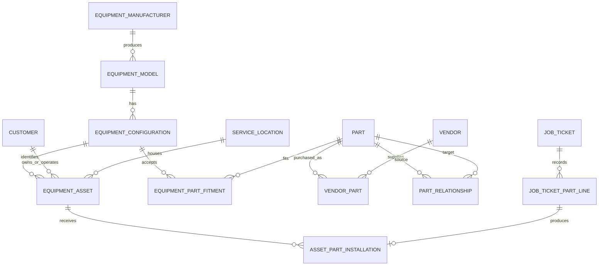

# Proposed Schema Redesign Scope Update

Date: 2026-07-14

Status: Proposed - awaiting steering review and explicit approval

## Purpose

This document proposes a foundational correction to the customer, equipment, parts, contact, address, notes, service-history, and employee-rate model.

The proposal responds to a core business requirement: reusable equipment and parts knowledge must be recorded once and shared across matching equipment, while the service and replacement history for each physical customer-owned unit must remain separate.

This is a scope and architecture proposal only. It does not approve migrations, API changes, UI implementation, automatic compatibility decisions, recommendation scoring, purchasing expansion, inventory expansion, or any other deferred workflow.

## Business Problem

The current `Equipment` record contains both generic model information and physical-unit information. `EquipmentCompatiblePart` is then keyed by the physical equipment record.

That produces the wrong operational result:

- Fifteen customer-owned units of the same model can require fifteen separate compatible-parts lists.
- Knowledge learned while servicing one unit cannot be reused reliably for another matching unit.
- Part usage on a ticket can be confused with proof that a part is compatible or installed.
- Multiple part brands, suppliers, substitutes, required accessories, and kit relationships cannot be represented cleanly.
- Mutable employee rates cannot answer historical pay and costing questions after a rate change.
- Embedded customer contacts and addresses do not support multiple roles, effective dates, or historical document snapshots.

The intended business value is a reusable fitment matrix, not merely a collection of customer-specific parts lists.

## Scope Outcome

The target architecture separates three kinds of information:

1. Shared catalog knowledge: what an equipment model or configuration is and which parts fit it.
2. Customer asset information: which exact physical unit a customer owns or operates.
3. Historical service facts: what work was performed and which part was installed, removed, or replaced on that exact unit.

## Proposed Terminology

| Term | Meaning |
|---|---|
| Equipment model | Reusable manufacturer and model family shared by many physical units. |
| Equipment configuration | Fitment-relevant model variant, such as model year, engine, capacity, trim, or serial range. |
| Equipment asset | One physical customer-owned or customer-operated unit with a serial number, unit number, owner, location, and service history. |
| Part fitment | A reviewed compatibility relationship between an equipment configuration, a component application, and a part. |
| Part relationship | A verified relationship such as substitute, equivalent, supersedes, requires, accessory-for, or kit-component. |
| Part usage | A part requested, approved, consumed, or billed through a job ticket. Usage does not automatically prove installation. |
| Asset part installation | A historical record that a specific part was installed on a specific physical asset. |
| Historical snapshot | Values copied onto a transaction so later master-data changes do not rewrite history. |

These terms should replace ambiguous uses of `Equipment` wherever the distinction matters.

## Target Domain Responsibilities

### Equipment catalog

The shared catalog should contain:

- `EquipmentManufacturer`
- `EquipmentModel`
- `EquipmentConfiguration`
- Optional controlled equipment-type references

Configuration boundaries should be based only on attributes that can change fitment. Matching make, model, and year may not be sufficient when engine, capacity, trim, or serial range changes the required part.

### Customer equipment assets

`EquipmentAsset` should identify one physical unit and contain instance-specific facts such as:

- Equipment configuration reference
- Serial number
- Unit or fleet number
- Manufactured year when it is an asset-specific fact
- Owner customer
- Operator or service customer
- Responsible billing customer
- Service location
- Current status
- Asset-specific operational notes

The current generic `CustomerId` relationship must be replaced or clearly defined. Owner, operator/service customer, and billing responsibility are different business roles.

### Equipment and part fitment

`EquipmentPartFitment` should identify compatibility at the equipment-configuration level and include:

- Equipment configuration
- Part
- Component or service application
- Fitment status
- Evidence source and source reference
- Notes
- Verified by user
- Verified date
- Optional effective year or serial limitations

Initial fitment statuses should support at least:

- Candidate
- Verified
- Incompatible
- Retired

Historical usage and existing per-asset compatible-parts records may create candidate evidence. They must not automatically become verified compatibility.

The current preventative-maintenance flag should not permanently live on the compatibility relationship. A part being compatible and a part being required by a maintenance plan are different facts.

### Parts, vendors, and relationships

`Part` should represent the manufactured catalog item, including its brand or manufacturer and manufacturer part number.

`VendorPart` should represent the supplier-specific offer, including:

- Vendor
- Vendor SKU
- Purchasing description
- Current cost
- Preferred-supplier status
- Optional lead-time information

One part may be sold by many vendors. Purchase-order and job-ticket lines should continue to snapshot monetary values.

`PartRelationship` should support reviewed relationships such as:

- Equivalent
- Substitute
- Supersedes
- Requires
- Accessory for
- Kit component

Two parts fitting the same application does not automatically make them equivalent.

### Job-ticket part workflow and asset installation history

The current job-ticket part structure already contains useful snapshots and installation-related fields. Those facts should be preserved during migration.

The target model should distinguish:

- `JobTicketPartLine`: request, approval, ordering, usage, and billing workflow.
- `AssetPartInstallation`: the physical installation lifecycle on one equipment asset.

An asset installation should record:

- Equipment asset
- Part or unlisted-part snapshot
- Source job ticket and ticket-part line
- Component application or position
- Installed date
- Removed date
- Replaced installation reference
- Quantity
- Outcome and notes

Only records with defensible installation evidence should be migrated as installations. Ambiguous historical records should remain part-usage history.

## Customer, Address, And Contact Scope

### Address

Add an `Address` concept for postal and geographic facts.

Use explicit relationships rather than a polymorphic entity ID:

- `CustomerAddress` identifies billing, mailing, service, or other address roles.
- `ServiceLocation` references an address while retaining access, safety, gate, and site-specific information.
- Address relationships may carry primary status and effective dates.

Historical work orders and invoices must retain address snapshots. Changing a current address must not rewrite a historical business document.

### Contact

Add a `Contact` concept for a person and `ContactMethod` for phone, email, or another communication channel.

Use explicit relationships such as:

- `CustomerContact`
- `ServiceLocationContact`

The relationship should carry role, primary status, billing responsibility, notification responsibility, and effective dates where applicable.

Job tickets may prefill from current contacts, but finalized documents must preserve the contact values used for the historical transaction.

## Notes And Comments Scope

Most major business records need an exception mechanism, but a single ungoverned `Comment` field on every table is not sufficient.

The initial proposal is to add explicit note collections for the contexts that need them first:

- `CustomerNote`
- `ServiceLocationNote`
- `EquipmentAssetNote`

Each note should include:

- Content
- Category
- Visibility
- Effective-from and effective-to dates
- `ShowOnWorkOrder`
- Author and audit timestamps
- Archive or inactive status where required

Ticket-owned internal notes, customer-facing notes, and timeline entries remain ticket-owned.

Active work-order context should be assembled from visible customer, service-location, equipment-asset, and ticket notes. Finalized documents should snapshot the context required for historical accuracy.

Notes remain an exception mechanism. Repeated operational rules that affect system behavior should become structured data. For example, `Do not schedule on Monday` may begin as a customer note but should become a scheduling restriction when enforcement is required.

## Employee Rate History Scope

Mutable rate fields on `Employee` should be replaced by effective-dated records.

The proposed split is:

- `EmployeeCompensationRate` for hourly pay and optional internal or burdened cost.
- `LaborBillingRate` for customer billing rules unless steering confirms that billing is truly employee-specific.

Rate-history records should include:

- Employee or applicable pricing relationship
- Rate type
- Amount
- Effective-from date
- Effective-to date
- Change reason
- Changed by user
- Audit timestamps

Overlapping active rate periods must be prevented.

At time-entry creation, the application should resolve the applicable rate as of the work date and snapshot both the monetary values and source-rate references. Existing `TimeEntry` snapshots should be preserved.

Historical rates cannot be reconstructed from a single current employee value. Available payroll history must be imported; otherwise earlier values must be identified as unknown rather than guessed.

## Job-Ticket Decision Gate

Steering must decide whether one job ticket can service:

- Exactly one equipment asset; or
- Multiple equipment assets.

If a ticket always services one asset, `JobTicket` may retain one asset reference.

If a ticket can service multiple assets, introduce `JobTicketEquipment`, identify a primary asset when useful, and require equipment-specific part installations, work entries, and files to identify the applicable asset.

This decision must be made before the installation-history phase because it changes relationship cardinality and API contracts.

## Phased Implementation Plan

### Phase 0: Approve the domain contract

Goal: settle terminology and cardinality before implementation.

- Approve the glossary and target ER diagram.
- Approve ownership, archive, visibility, verification, and snapshot rules.
- Resolve the one-asset versus multiple-assets-per-ticket question.
- Resolve rate ownership and pricing semantics.
- Align the project scope, database design, API contract, roadmap, and system wiki.

Exit gate: steering explicitly approves the model and the first implementation slice.

### Phase 1: Profile existing data

Goal: understand data quality before automated grouping or backfill.

- Report duplicate manufacturer, model, year, equipment-type, contact, and address values.
- Identify assets missing model, serial, customer, location, or ownership relationships.
- Compare compatible-part lists across apparently identical assets.
- Classify ticket parts as requested, approved, used, installed, removed, or ambiguous.
- Inventory employee rates and historical time-entry snapshots.

Exit gate: a reconciliation report exists and ambiguous records are assigned for human review.

### Phase 2: Normalize customer context

Goal: introduce reusable addresses, contacts, and governed operational notes.

- Add the address and contact structures beside the existing fields.
- Add explicit note collections and visibility rules.
- Backfill existing billing addresses, service-location addresses, and contacts.
- Add historical document snapshot rules.
- Keep old columns available during the compatibility period.

Exit gate: migrated customer context reconciles with existing screens and reports.

### Phase 3: Introduce equipment catalog and assets

Goal: separate reusable equipment identity from the physical unit being serviced.

- Add manufacturer, model, configuration, and asset structures.
- Add nullable configuration references before requiring them.
- Generate candidate groupings from normalized existing fields.
- Require manager review for uncertain equipment groupings.
- Preserve existing equipment APIs through compatibility adapters.

Exit gate: every active physical unit is linked to an approved configuration or explicitly marked unresolved.

### Phase 4: Build the fitment matrix

Goal: store compatibility once at the equipment-configuration level.

- Add fitment records, statuses, source evidence, and verification auditing.
- Copy existing per-asset compatible parts as candidate fitments.
- Add Manager/Admin verification actions.
- Keep technician-safe fitment responses free of cost, billing, vendor, and catalog-administration fields.

Exit gate: one verified fitment is visible to every matching asset and does not appear for nonmatching configurations.

### Phase 5: Correct the parts catalog

Goal: represent manufactured parts, supplier offers, alternatives, and dependencies independently.

- Separate part identity from vendor offer.
- Add multiple vendor offers per part.
- Add reviewed part relationships.
- Preserve ticket and purchasing price snapshots.

Exit gate: a part can be purchased from multiple vendors and alternatives are explicit rather than inferred.

### Phase 6: Separate part usage from installation

Goal: record what was physically installed on one exact asset.

- Add asset installation history and replacement chains.
- Preserve source ticket, ticket-part, and snapshot references.
- Backfill only defensible installations.
- Retain ambiguous historical rows as usage history.
- Apply the approved one-asset or multiple-assets-per-ticket design.

Exit gate: installation history for one asset never appears as installation history for another.

### Phase 7: Add effective-dated rates

Goal: answer historical pay, cost, and billing questions accurately.

- Add effective-dated compensation and approved billing-rate structures.
- Validate that active periods do not overlap.
- Resolve rates as of the work date.
- Snapshot source rate IDs and values on new time entries.
- Retire current-rate reporting fallbacks after legacy reconciliation.

Exit gate: a rate change affects future calculations without changing any prior entry or report.

### Phase 8: Transition APIs and UI

Goal: expose corrected concepts while maintaining operating continuity.

- Separate Equipment Catalog from Customer Equipment screens.
- Add explicit catalog, asset, fitment, part-relationship, installation-history, customer-context, and rate-history DTOs.
- Temporarily retain existing equipment compatible-parts routes through asset-to-configuration resolution.
- Display inherited fitment separately from asset-specific service history.
- Preserve authorization and technician-safe data boundaries.

Exit gate: existing workflows run through compatibility contracts while new screens use target contracts.

### Phase 9: Cut over and clean up

Goal: remove obsolete structures only after successful reconciliation and a stable release.

- Switch all reads and writes to the new model.
- Stop compatibility dual-writes.
- Back up production data and rehearse rollback.
- Remove obsolete fields and per-asset compatibility records after the retention window.
- Rename ambiguous DTOs and labels.
- Update all steering and operational documentation.

Exit gate: reconciliation is clean, monitoring is stable, and rollback has been rehearsed.

## Migration Controls

The following controls apply to every approved implementation phase:

| Control | Requirement |
|---|---|
| Add before remove | New tables and nullable references must exist before old fields are retired. |
| No blind merging | Normalized text may propose matches, but ambiguous catalog and fitment records require human confirmation. |
| Preserve source identity | Backfilled records retain their source equipment, ticket-part, time-entry, customer, contact, or address identifier. |
| Candidates are not facts | Historical usage and current per-asset parts lists remain candidates until verified. |
| Immutable history | Ticket, installation, rate, contact, and address snapshots do not change with current master data. |
| Forward migrations only | Do not modify historical EF Core migrations; add one scoped forward migration per approved schema phase. |
| Compatibility window | Existing API consumers remain supported until all known callers transition. |
| Reconcile every phase | Compare row counts, nulls, foreign keys, duplicates, totals, and representative business scenarios. |

## Decisions Required Before Implementation

| Decision | Recommended default |
|---|---|
| One or many assets per ticket | Keep one asset unless actual tickets regularly service multiple units. Resolve before Phase 6. |
| Configuration granularity | Split configurations only on attributes that can change fitment. |
| Equipment customer roles | Name owner, operator/service customer, and billing responsibility explicitly. |
| Billing-rate ownership | Keep compensation history separate and approve pricing rules before designing billing-rate tables. |
| Notes visibility | Use explicit internal, technician, and customer-facing visibility plus `ShowOnWorkOrder`. |
| Historical snapshot point | Snapshot selected business-document context at closeout or invoice-ready transition. |
| Fitment verification authority | Restrict verification to Manager/Admin and retain evidence, verifier, and audit data. |

## Acceptance Criteria

The redesign is complete only when:

- Entering one oil-filter fitment for a Frontier configuration exposes it to every matching customer asset.
- One part can fit many configurations and one configuration can have several verified alternatives.
- A wiring harness can be related to a tow package without being represented as the same part.
- Installing or replacing a part on one asset never places it in another asset's history.
- Customer, service-location, and asset notes appear according to visibility and work-order rules.
- Historical time entries retain correct pay, cost, and billing snapshots after a rate change.
- Changing a current contact or address does not rewrite a historical work order or invoice.
- Existing tickets, reports, authorization, soft deletion, explicit enum values, and technician-safe boundaries remain intact.
- Backend build, frontend build, focused tests, integration tests, migration reconciliation, backup, and rollback rehearsal pass.
- The public `/health` endpoint remains available.

## Protected Baseline

This proposal must preserve:

- The existing `Domain`, `Application`, `Infrastructure`, and `Api` layer boundaries.
- JWT authentication and role enforcement.
- Inactive, archived, or deleted user-token rejection.
- Employee assigned-job workflow.
- Manager/Admin and Admin-only route boundaries.
- DTO-based APIs.
- Soft-delete and archive behavior.
- Explicit backend enum numeric values.
- Historical ticket-part and time-entry snapshots.
- The public `/health` endpoint.

## Explicitly Not Approved By This Proposal

This document does not approve:

- Automatic compatibility decisions.
- AI or recommendation scoring.
- Automatic fitment promotion from service history.
- Automatic approval.
- Preventative-maintenance scheduling automation.
- Purchasing, receiving, vendor-invoice, landed-cost, or inventory expansion.
- Customer portal or customer self-service.
- Payment collection.
- Hard deletes.
- Authorization weakening.
- Backend enum renumbering.
- Editing historical migrations.
- Full workflow implementation before the scope and architecture contract is approved.

## Recommended First Action

Complete Phase 0 only.

Finish the schema review, resolve the listed decision gates, and approve the terminology and target relationships before creating any migration or implementation task.

## Repository Evidence Reviewed

This proposal was prepared from the current local repository model and steering documentation, including:

- `backend/src/Domain/Entities/DomainEntities.cs`
- `backend/src/Infrastructure/Persistence/Configurations/CoreEntityConfigurations.cs`
- `backend/src/Application/MasterData/EquipmentCompatiblePartsService.cs`
- `docs/database-design.md`
- `docs/project-scope.md`
- `docs/api-contract.md`
- `docs/build-roadmap.md`
- `docs/system-wiki.md`
