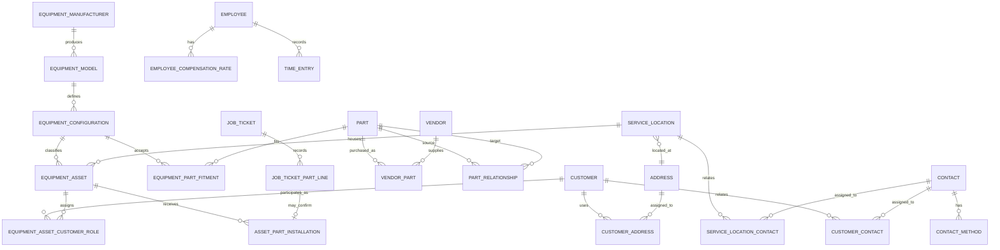

# Schema Redesign Domain Contract

Date: 2026-07-20

Status: In review - Epic 0

## Purpose

This document is the source of truth for Epic 0 of the schema redesign. It defines the proposed domain language, ownership boundaries, invariants, module responsibilities, decision register, and worked examples that must be approved before schema or application implementation begins.

This contract responds to the operational need to record reusable equipment and parts knowledge once while preserving the service history of each physical customer asset.

Epic 0 is documentation only. This document does not approve:

- EF Core migrations;
- database backfills;
- API or DTO changes;
- frontend workflow changes;
- automatic fitment decisions or recommendations;
- purchasing or inventory expansion;
- historical migration edits; or
- removal of existing fields, routes, or behavior.

The dated [schema redesign proposal](./proposed-schema-redesign-scope-update-2026-07-14.md) remains supporting analysis. This contract controls terminology and approval status for implementation planning.

## Business Outcome

The redesigned model must answer three different questions without mixing their data:

1. What is this kind of equipment, and which parts fit it?
2. Which exact physical unit is the company servicing?
3. What work, part usage, and installation history occurred on that unit?

The system should reduce repeated parts research across equivalent equipment without turning unverified history into guaranteed compatibility.

## Guiding Principles

1. **Catalog knowledge is reusable.** Manufacturer, model, configuration, and fitment facts belong to shared catalog records.
2. **Physical assets have independent history.** Serial numbers, unit numbers, ownership, service history, and installed components belong to the exact customer asset.
3. **Evidence is not proof.** A part appearing on a ticket or existing equipment list may support a fitment candidate, but it is not automatically verified compatibility or proof of installation.
4. **Transactions preserve history.** Ticket, installation, rate, contact, and address snapshots remain unchanged when master data changes.
5. **Relationships are explicit.** Use foreign keys and named relationship entities instead of generic `EntityType` and `EntityId` links.
6. **Exceptions are governed.** Notes provide an exception mechanism with category, visibility, effective dates, and work-order behavior. Repeated enforceable rules should become structured data.
7. **Add before removing.** New structures and nullable references arrive before old fields or endpoints are retired.
8. **Humans resolve ambiguity.** Normalized data may propose matches, but uncertain configurations, fitments, contacts, addresses, and installations require review.
9. **Modules own their rules.** Cross-module access occurs through explicit IDs, DTOs, and application interfaces; one module must not silently mutate another module's history.
10. **Current operations remain protected.** Authorization, soft deletion, enum values, existing tickets, reporting, and `/health` remain stable throughout the transition.

## Domain Modules

The target remains a modular monolith. These are code and ownership boundaries inside the existing application, not independently deployed services.

| Module | Owns | Does not own |
|---|---|---|
| Customer Context | Customers, addresses, contacts, customer/location roles, operational notes | Equipment fitment, ticket history, employee rates |
| Equipment Catalog | Manufacturers, model families, fitment-relevant configurations, reviewed fitments | Physical asset ownership or service history |
| Customer Assets | Physical equipment units, ownership roles, locations, asset notes, installation history | Shared fitment truth or supplier offers |
| Parts Catalog | Manufactured parts, supplier offers, part-to-part relationships | Ticket approval state or physical installation lifecycle |
| Tickets and Service | Job tickets, work records, ticket-part usage, transactional snapshots | Master-data identity or verified fitment ownership |
| Workforce and Rates | Employees, effective-dated compensation, approved billing-rate source | Ticket labor snapshots after they are recorded |

Suggested code organization:

```text
Domain/
  CustomerContext/
  EquipmentCatalog/
  CustomerAssets/
  PartsCatalog/
  Tickets/
  Workforce/

Application/
  CustomerContext/
  EquipmentCatalog/
  CustomerAssets/
  PartsCatalog/
  Tickets/
  Workforce/
```

Infrastructure continues to provide EF Core configurations and persistence for these modules. API controllers remain HTTP adapters only. The frontend should use matching feature terminology and keep catalog management separate from customer-asset workflows.

### Modularity guardrails

- Keep one primary business concept per domain file; do not extend the existing all-entities file with the new model.
- Keep one EF Core entity configuration per file, grouped under the owning module.
- Model application behavior as focused use cases and validators; do not create a single schema-redesign or master-data service that owns unrelated workflows.
- Keep controllers resource-focused and free of business rules.
- Keep DTOs specific to their caller and authorization boundary instead of returning large shared entity-shaped contracts.
- Build frontend pages from feature-specific API modules, hooks, forms, lists, and review components rather than adding the entire redesign to one page component.
- Allow cross-module dependencies only through explicit identifiers, read contracts, or application interfaces.
- Add tests beside the owning behavior: domain invariants, application use cases, infrastructure mappings and migrations, API authorization/contracts, and frontend workflow states.

## Codex Delivery Model Contract

[Codex Model Routing](./codex-model-routing.md) defines the required task-to-model guidance for this epic and its later approved implementation phases.

- Use GPT-5.6 Sol at Extra High reasoning for domain decisions, relationship and migration design, backfill safety, historical snapshots, fitment and installation invariants, effective-dated rates, and cutover review.
- Use GPT-5.6 Terra at High reasoning for bounded implementation slices after their contracts are approved.
- Use GPT-5.6 Luna only for low-risk mechanical work with deterministic validation and a stronger review when business meaning is involved.
- Record the selected model, reasoning level, escalation condition, required review, and approval gate in each task.
- Model capability never substitutes for steering approval, human ambiguity review, reconciliation evidence, or production authorization.

## Glossary

| Term | Contract meaning |
|---|---|
| Customer | An account or party that may request service, own or operate an asset, or be responsible for billing. These roles must be named where they differ. |
| Address | Reusable postal and geographic facts without customer-, site-, or ticket-specific behavior. |
| Address assignment | A named relationship between an address and a customer or service location, including role, primary status, and effective dates where required. |
| Contact | A person who may be related to multiple customers or service locations. |
| Contact method | One communication channel for a contact, such as phone or email. |
| Operational note | A governed exception or context record with category, visibility, effective dates, author, and work-order behavior. |
| Equipment manufacturer | The reusable manufacturer identity for equipment models. |
| Equipment model | A reusable manufacturer and model family shared by many physical units. |
| Equipment configuration | A fitment-relevant variant of a model, separated only by attributes that can change fitment, such as engine, capacity, trim, year range, or serial range. |
| Equipment asset | One physical customer-owned or customer-operated unit with its own serial number, unit number, location, customer roles, and service history. |
| Component application | The functional position or use for a part, such as oil filter, air filter, tow package, or wiring harness. |
| Part | A manufactured catalog item identified by brand or manufacturer and manufacturer part number. |
| Vendor part | A supplier-specific offer for a part, including vendor SKU, purchasing description, cost, lead information, and preference. |
| Part fitment | A reviewed relationship between an equipment configuration, component application, and part. |
| Fitment candidate | Evidence that may support compatibility but has not been verified by an authorized user. |
| Part relationship | An explicit directional relationship such as equivalent, substitute, supersedes, requires, accessory-for, or kit-component. |
| Part usage | A part requested, approved, ordered, consumed, or billed through a ticket. Usage does not prove compatibility or installation. |
| Asset part installation | A historical record that a specific part was installed on a specific physical asset. |
| Historical snapshot | Values copied onto a transaction or historical record so later master-data changes do not rewrite history. |
| Effective-dated rate | A rate record valid for a bounded period and selected according to the applicable work date. |
| Legacy equipment record | The current implemented `Equipment` record. During transition it continues to identify the physical unit and existing API resource. |

## Terminology Transition

The current application uses `Equipment` for the physical unit and `EquipmentCompatiblePart` for a per-unit compatible-parts list. During the compatibility period:

- existing routes and DTO names retain their current meaning;
- documentation calls the physical record a **legacy equipment record** when the distinction matters;
- new catalog contracts use **equipment model**, **equipment configuration**, and **fitment**;
- new physical-unit contracts use **equipment asset**;
- existing `Equipment` IDs must remain traceable through any eventual rename or migration; and
- UI labels should not change until the corresponding feature slice is approved and implemented.

## Target Relationship Model



The diagram is conceptual. Exact optionality and the job-ticket-to-asset cardinality remain subject to the decision register.

## Core Invariants

### Customer context

- An address stores postal and geographic facts only.
- Customer address roles and effective dates belong to `CustomerAddress`, not `Address`.
- Site access, gate, safety, and location-specific instructions remain owned by `ServiceLocation`.
- A contact is a person; customer or site responsibility belongs to the relationship record.
- Historical documents must not change when a current address, contact, or note changes.
- Note visibility must be evaluated before content is returned to a caller or included on a work order.

### Equipment catalog

- An equipment model belongs to exactly one manufacturer.
- A configuration belongs to exactly one model.
- Configuration identity includes only attributes that can affect fitment.
- A configuration with historical use is retired or superseded instead of being silently changed into a different fitment identity.
- A fitment always identifies a configuration, component application, and part.
- Only authorized Manager/Admin verification can promote a candidate to verified fitment.
- Usage history may supply evidence but cannot automatically verify fitment.
- A verified fitment for one configuration must not appear for a nonmatching configuration.

### Customer assets

- An equipment asset represents one physical unit.
- Asset service and installation history belongs to that asset even when ownership, billing, or location changes.
- Serial and unit identifiers are asset facts, not shared model facts.
- An asset may be unresolved during migration, but the unresolved state must be explicit and reviewable.
- Asset history must retain the originating legacy equipment ID.

### Parts catalog

- A part identifies the manufactured item independently of its suppliers.
- A part may have zero or many vendor offers.
- Supplier SKU, current supplier cost, and preferred-supplier state belong to `VendorPart`.
- Part relationships are explicit and directional where their meaning is directional.
- Two parts fitting the same configuration are not automatically equivalent.
- Ticket and purchase records retain their monetary snapshots when current supplier data changes.

### Tickets and installations

- A ticket-part line represents request, approval, ordering, usage, and billing workflow.
- A ticket-part line is not automatically proof of physical installation.
- An installation belongs to exactly one physical asset.
- An installation retains its source ticket and ticket-part identity when available.
- Removing or replacing a part closes or links installation history; it does not rewrite the original installation.
- Ambiguous legacy ticket parts remain usage history rather than being guessed into installation history.

### Workforce and rates

- Current employee compensation is derived from effective-dated history rather than a mutable employee field.
- Active compensation periods for the same employee and rate type must not overlap.
- The applicable rate is resolved as of the approved work date.
- A time entry snapshots the values used and, where available, their source-rate IDs.
- Changing a future or current rate must not change a historical time entry or report.
- Unknown historical rates remain unknown unless reliable source data is imported.

## Note Contract

The accepted direction is that major operational records need an exception mechanism. The initial explicit note collections are:

- `CustomerNote`;
- `ServiceLocationNote`; and
- `EquipmentAssetNote`.

Each note is expected to include:

- content;
- category;
- visibility;
- effective-from and optional effective-to dates;
- `ShowOnWorkOrder`;
- author and audit timestamps; and
- archive or inactive state when required.

Ticket notes and timeline entries remain ticket-owned. A note such as "Never schedule work on Monday" may initially provide visible context, but it must become a structured scheduling restriction before the application enforces it automatically.

## Historical Snapshot Contract

Master data is mutable; completed business history is not. The target model must preserve the values actually used for:

- ticket customer and billing context;
- service and billing addresses;
- selected contacts;
- work-order-visible notes when required by the approved snapshot point;
- part number, name, cost, and sale price;
- installed-part identity and description;
- pay, cost, and billing rates; and
- source record IDs used during backfill or resolution.

Snapshot data should be explicit and queryable. It must not depend on the current value of a related master record.

## Archive And Identity Contract

- Historical business records are not hard deleted.
- Catalog and master-data records referenced by history are retired or archived.
- Archived records remain readable where required to explain historical transactions.
- Existing primary keys are preserved where practical.
- Every backfilled record stores or can trace its source legacy identity.
- Historical EF Core migrations are never edited; every approved schema step receives a new forward-only migration.

## Authorization Contract

- Existing authorization policies remain the minimum boundary.
- Fitment verification and catalog administration require Manager/Admin authorization.
- Technician-safe fitment responses must not expose cost, billable price, vendor cost, inventory, purchasing, or catalog-administration fields.
- Note visibility is enforced in Application/API responses, not only hidden in the frontend.
- Installation confirmation permissions must be approved with the closeout workflow; no permission expansion is implied by this contract.

## Decision Register

`Pending steering` means implementation is blocked on explicit approval. `Accepted direction` records a business principle already established while leaving detailed schema design for its implementation slice.

| ID | Decision | Status | Recommended default | Implementation impact |
|---|---|---|---|---|
| D-001 | Can one job ticket service one asset or multiple assets? | Pending steering | One asset per ticket unless real operating examples regularly cover multiple units. | Determines whether `JobTicket` keeps one asset FK or uses `JobTicketEquipment`. |
| D-002 | Which attributes create a distinct equipment configuration? | Pending steering | Split only on attributes proven capable of changing fitment. | Controls false-positive fitments and catalog duplication. |
| D-003 | How are asset customer roles represented? | Pending steering | Name owner, operator/service customer, and responsible billing customer explicitly. | Controls asset relationships, billing defaults, and history. |
| D-004 | Where does labor billing rate ownership belong? | Pending steering | Keep employee compensation separate; design billing around the approved customer, contract, job type, or schedule rule. | Controls rate tables and time-entry resolution. |
| D-005 | Which note audiences and categories are required initially? | Accepted direction; details pending | Internal, technician-visible, work-order-visible, and customer-facing visibility with explicit category. | Controls note enums, DTO filtering, and document output. |
| D-006 | When is customer-facing context snapshotted? | Pending steering | At closeout or invoice-ready transition. | Controls document history and closeout behavior. |
| D-007 | Who may verify fitment? | Accepted direction | Manager/Admin only, with verifier, date, source, and audit history. | Controls authorization and candidate review workflow. |
| D-008 | How should the current `Equipment` row become an asset? | Pending steering | Preserve the row and ID, add a nullable configuration reference, and defer naming cleanup until cutover. | Avoids duplicate physical-unit records and unnecessary dual-write. |
| D-009 | How are configurations changed after historical use? | Accepted direction | Retire or supersede instead of mutating fitment identity. | Preserves historical meaning. |
| D-010 | Is preventative maintenance part of fitment? | Accepted direction | No. Fitment and maintenance requirements are separate facts. | Prevents the current PM flag from becoming a permanent fitment rule. |

## Worked Business Examples

### Example 1: 2017 Frontier oil filters

1. Three customers each own a different 2017 Frontier asset.
2. Each asset references the same approved Frontier configuration when its fitment-relevant attributes match.
3. Oil filters from multiple manufacturers may each have a verified fitment for the `Oil filter` application.
4. Verifying one fitment makes it available to all three matching assets.
5. Servicing one truck records ticket usage and, when confirmed, installation history only for that truck.

Expected result: shared research, no fifteen-copy compatible-parts list, and no cross-asset installation leakage.

### Example 2: Tow package and wiring harness

1. A tow package may fit more than one equipment configuration.
2. Five brands may provide distinct tow-package parts for the same application.
3. A wiring harness is a separate part related with `Requires` or `AccessoryFor`; it is not the same part as the tow package.
4. A substitute or equivalent relationship is recorded explicitly and is not inferred merely because both parts fit.

Expected result: the system can answer both "what fits?" and "what else is required?"

### Example 3: Customer scheduling exception

1. A customer note records "Never schedule work on Monday."
2. Its visibility and `ShowOnWorkOrder` settings determine where it appears.
3. Active ticket context includes it for authorized users.
4. The application does not automatically block Monday until an approved structured scheduling restriction exists.

Expected result: the exception is visible without pretending free text is an enforceable rule.

### Example 4: Employee pay raise

1. Jimmy's compensation rate is effective through the end of June.
2. A new rate begins July 1 without overwriting the earlier record.
3. June time entries retain the June rate snapshot and source rate.
4. July time entries resolve the July rate.

Expected result: historical pay and costing questions remain answerable after a raise.

### Example 5: Address correction

1. A customer corrects its current billing address.
2. New tickets prefill from the corrected address assignment.
3. A finalized prior work order retains its original address snapshot.

Expected result: current master data improves without rewriting historical documents.

## Compatibility And Migration Rules

These rules apply to later epics once explicitly approved:

- add tables and nullable references before requiring new data;
- retain old columns and endpoints during a measured compatibility window;
- backfill with source IDs and reconciliation states;
- treat normalized text matching as candidate generation only;
- dual-read or adapt before dual-writing, and keep any dual-write period short and tested;
- reconcile counts, nulls, foreign keys, duplicates, totals, and representative scenarios in every phase;
- remove obsolete structures only after backup, rollback rehearsal, and a stable release window; and
- keep `/health`, existing workflows, and role boundaries available throughout.

## Epic 0 Acceptance Checklist

- [x] Business outcome and guiding principles documented.
- [x] Domain modules and ownership boundaries documented.
- [x] Glossary and terminology transition documented.
- [x] Conceptual relationship model documented.
- [x] Core invariants documented.
- [x] Notes, snapshots, archive, identity, and authorization contracts documented.
- [x] Worked business examples documented.
- [x] Existing steering documents point to this contract.
- [ ] D-001 through D-008 receive explicit steering disposition where still pending.
- [ ] The target relationship model is approved.
- [ ] The first data-profiling slice is approved.
- [ ] Epic 0 status is changed from `In review` to `Approved`.

No migration or application implementation may begin until the remaining approval items are complete.

## Approval Record

| Review item | Reviewer | Date | Disposition |
|---|---|---|---|
| Glossary and terminology | Pending | Pending | Pending |
| Module boundaries | Pending | Pending | Pending |
| Relationship model | Pending | Pending | Pending |
| Decision register | Pending | Pending | Pending |
| First profiling slice | Pending | Pending | Pending |
