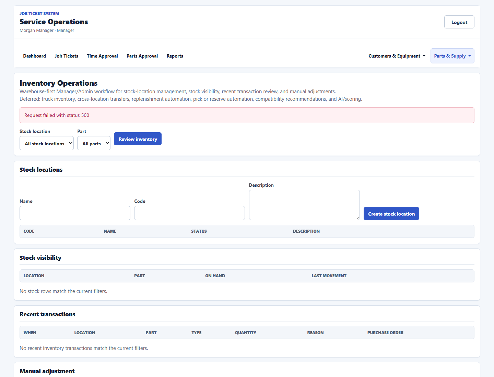

# Job Ticket System Wiki

## Purpose
This wiki explains how the Job Ticket System is used by Employees, Managers, and Admins. It is written for client handoff and operations training, not for software development.

The system is centered on field-service job tickets:
- create and manage service tickets;
- assign employees to work;
- let technicians clock in, record work, request parts, and upload photos/files;
- let Managers/Admins review work, time, parts, reports, users, and supporting master data;
- preserve role boundaries so each user sees the tools appropriate to their job.

Screenshots in this wiki are captured from the demo/pilot environment. They are intended to show screen layout and workflow behavior, not production customer data.

## Client Quick Start

For a first client walkthrough, use this order:

1. Start with [Roles And Access](#roles-and-access) so users understand what each account type can do.
2. Review [Sign-In And Session Behavior](#sign-in-and-session-behavior).
3. Walk technicians through [Employee Workflow](#employee-workflow).
4. Walk office staff through [Manager/Admin Workspace](#manageradmin-workspace).
5. Review [Time Tracking And Approval](#time-tracking-and-approval), [Parts And Part Requests](#parts-and-part-requests), and [Reports](#reports).
6. Finish with [Current Scope Boundaries](#current-scope-boundaries) so the client knows what is intentionally not included.

For live training, use the [Client Training Checklist](#client-training-checklist) near the end of this wiki.

## Screenshot Index

The screenshots below appear again in the workflow sections where they are most relevant:

| Screen | Screenshot |
| --- | --- |
| Login | [login.png](assets/system-wiki/login.png) |
| Employee assigned jobs | [employee-jobs.png](assets/system-wiki/employee-jobs.png) |
| Employee job detail | [employee-job-detail.png](assets/system-wiki/employee-job-detail.png) |
| Manager/Admin dashboard | [manager-dashboard.png](assets/system-wiki/manager-dashboard.png) |
| Job-ticket queue | [job-ticket-queue.png](assets/system-wiki/job-ticket-queue.png) |
| Job-ticket workspace | [job-ticket-workspace.png](assets/system-wiki/job-ticket-workspace.png) |
| Time approval | [time-approval.png](assets/system-wiki/time-approval.png) |
| Parts requests | [part-requests.png](assets/system-wiki/part-requests.png) |
| Master data customers | [master-data-customers.png](assets/system-wiki/master-data-customers.png) |
| Purchasing support | [purchasing.png](assets/system-wiki/purchasing.png) |
| Inventory foundation | [inventory.png](assets/system-wiki/inventory.png) |
| Reports hub | [reports-hub.png](assets/system-wiki/reports-hub.png) |
| Admin users | [admin-users.png](assets/system-wiki/admin-users.png) |

## Roles And Access

### Employee
Employees use the mobile-focused job workflow.

Employee users can:
- sign in;
- view jobs assigned to them;
- open assigned job details;
- review job readiness information;
- clock in and clock out with GPS;
- add work notes after clocking into the job;
- add or request parts after clocking into the job;
- upload job photos/files after clocking into the job;
- view work entries, parts/request status, and uploaded files for the assigned job.

Employee users cannot:
- view Manager/Admin workspace screens;
- manage users;
- manage master data;
- view part cost, billable price, vendor cost, purchase history, inventory controls, catalog cleanup, or invoice-facing billing controls.

### Manager
Managers use the Manager workspace for operational coordination.

Manager users can:
- view the dashboard;
- create and manage job tickets;
- assign employees;
- review job-ticket details and workflow tabs;
- review and update status/priority;
- review employee time entries;
- approve, reject, or edit-and-approve time entries;
- manage customer, location, equipment, vendor, part category, and part records;
- review part requests;
- use reports;
- use the existing purchasing-support and inventory-foundation screens.

Manager users cannot:
- access Admin-only user management;
- weaken role boundaries;
- perform hard deletes.

### Admin
Admins have Manager capabilities plus user administration.

Admin users can:
- create user accounts;
- edit user account information;
- deactivate/archive users;
- reset user passwords;
- filter users by search, role, and active/inactive status;
- access all Manager/Admin operational screens.

## Navigation Overview

### Public And Login
- `/login`: sign-in screen.
- `/health`: public system health endpoint.
- `/api/system/info`: public system information endpoint.

### Employee Routes
- `/jobs`: employee assigned jobs list.
- `/jobs/{jobTicketId}`: employee job detail and field-recording workflow.

### Manager/Admin Routes
- `/manage`: Manager/Admin dashboard.
- `/manage/job-tickets`: job-ticket queue.
- `/manage/job-tickets/new`: create job ticket.
- `/manage/job-tickets/{jobTicketId}`: job-ticket workspace.
- `/manage/customers`: customers.
- `/manage/service-locations`: service locations.
- `/manage/equipment`: equipment.
- `/manage/parts`: parts, vendors, and part categories.
- `/manage/part-requests`: parts request queue.
- `/manage/inventory`: inventory foundation.
- `/manage/purchasing`: purchasing support.
- `/manage/parts-usage-history`: parts usage history visibility.
- `/manage/time-approval`: time approval queue.
- `/manage/parts-approval`: parts approval workflow.
- `/manage/reports`: reports hub.
- `/manage/users`: Admin-only user management.

## Sign-In And Session Behavior

1. The user opens the application and signs in with a username and password.
2. After sign-in:
   - Employee users are sent to `/jobs`.
   - Manager and Admin users are sent to `/manage`.
3. Protected routes require an authenticated user with the correct role.
4. Unauthorized users are redirected away from restricted screens.
5. Inactive, archived, or deleted users should not be allowed to continue using protected workflows.

## Employee Workflow

### Assigned Jobs List
The employee job list shows assigned work in a mobile-friendly layout.

Employees can review:
- ticket number;
- title;
- status;
- priority;
- scheduled start;
- due date;
- customer;
- service location;
- equipment;
- readiness status;
- next required update.

Readiness helps employees understand whether a job has enough information to start. It may flag:
- inactive or completed ticket status;
- missing scheduled start;
- missing due date;
- missing customer;
- missing service location.

### Opening A Job
When an employee opens a job, the detail screen shows:
- ticket number and title;
- status and priority;
- customer, service location, and equipment labels;
- job description;
- readiness checks;
- clock-in/clock-out controls;
- work note form;
- add/request part form;
- upload photo/file form;
- work entries;
- parts requests and usage;
- uploaded files/photos.

The UI should show names and labels, not customer IDs, service-location IDs, equipment IDs, or GUIDs.

### Job Readiness Review
The job detail page includes a "Before You Start" review.

It checks:
- ticket availability for field work;
- scheduled start;
- due date;
- customer;
- service location;
- equipment assignment;
- job instructions.

If information is missing, the employee should contact a Manager/Admin before starting or continuing work.

### Clock In
Employees clock in from the job detail screen.

Clock-in records:
- job ticket;
- employee;
- GPS latitude;
- GPS longitude;
- GPS accuracy;
- device metadata;
- optional clock note.

If GPS is unavailable or the request fails, the screen shows an error.

### Clock Out
Employees clock out from the same job detail screen.

Clock-out requires:
- an open time entry for the same job;
- a work summary;
- GPS information.

Clock-out records:
- clock-out GPS latitude;
- clock-out GPS longitude;
- GPS accuracy;
- work summary;
- optional note.

### Field Recording Guard
Employees must be clocked into the selected job before adding field records.

The guard applies to:
- work notes;
- ticket parts;
- part requests;
- photo/file uploads.

If an employee is clocked into another job, they must open that active ticket or clock out before recording work on a different ticket.

Manager/Admin back-office actions are not gated by an employee clock-in.

### Add Work Note
Employees can add work notes only after clocking into the job.

Work notes are for:
- progress updates;
- site conditions;
- performed work details;
- information the office needs to review.

### Add Or Request Part
Employees can add or request a part only after clocking into the job.

Employees can:
- search existing safe part records by part number, name, or description;
- select an existing part;
- type a new/unlisted part;
- enter quantity;
- enter notes;
- mark whether the part needs to be ordered;
- choose urgency when ordering is needed;
- enter needed-by date when ordering is needed.

If `Needs ordered` is selected:
- the item appears in the Manager/Admin parts request queue.

If `Needs ordered` is not selected:
- the item is recorded on the ticket without creating a back-office order queue item.

Technicians do not see or enter:
- unit cost;
- billable price;
- vendor cost;
- purchase history;
- catalog administration;
- inventory controls;
- invoice-facing billing fields.

### Upload Photo Or File
Employees can upload files only after clocking into the job.

Allowed file types:
- JPG;
- JPEG;
- PNG;
- WebP;
- PDF.

Employees can add an optional caption.

Unsupported file types are rejected.

## Manager/Admin Workspace

### Dashboard
The dashboard summarizes operational work and provides quick entry into common queues.

Typical dashboard actions include:
- review active job tickets;
- open filtered job queues;
- check dispatch/readiness attention areas;
- move into time approval, parts requests, reports, or master-data workflows.

Dashboard links use the same Manager/Admin role boundary as the rest of the workspace.

### Job Ticket Queue
The job-ticket queue is the main Manager/Admin work list.

Managers/Admins can filter by:
- status;
- priority;
- customer;
- dispatch readiness;
- attention condition;
- search text.

Managers/Admins can export the currently visible queue rows to CSV. The export reflects the loaded filtered view and includes readable labels for customer, service location, assigned employees, lead employees, and dispatch readiness. It does not create a server-side export job.

Queue URLs are shareable. If a Manager/Admin opens a ticket from a filtered queue, the ticket detail can preserve a safe return link back to that queue.

Important queue concepts:
- active job queue;
- waiting tickets;
- waiting on parts;
- invoice-ready queue;
- needs dispatch review;
- dispatch-ready queue;
- unassigned tickets;
- tickets needing a lead;
- unscheduled tickets;
- tickets missing a due date.

### Create Job Ticket
Managers/Admins create tickets from `/manage/job-tickets/new`.

Job-ticket creation uses existing master data where applicable:
- customer;
- service location;
- equipment;
- billing party customer;
- assigned manager;
- status and priority;
- schedule and due date;
- job title/type/description;
- internal notes and customer-facing notes.

Validation prevents invalid or incomplete submissions where the UI has enough information to do so.

### Job Ticket Workspace
The Manager/Admin ticket detail page is organized as a field-service workbench.

It includes:
- ticket overview;
- customer context;
- service location context;
- equipment context;
- assignments;
- service scope and notes;
- status and priority review;
- time/labor visibility;
- parts used or requested;
- files/photos;
- activity;
- invoice-ready summary;
- recommended next action;
- workflow tabs.

Workflow tabs include:
- Overview;
- Dispatch;
- Time;
- Parts;
- Files;
- Closeout;
- Activity.

The workspace keeps related work on one screen instead of forcing Managers/Admins through scattered pages.

### Ticket Editing
Managers/Admins can edit ticket information through a focused panel.

The edit workflow should preserve:
- customer/service-location relationships;
- equipment relationships;
- assigned manager context;
- status and priority values;
- notes and schedule fields.

### Assignment Management
Managers/Admins can assign active, non-archived Employee users to tickets.

Assignments may include lead assignment behavior where supported by the UI.

The employee assignment dropdown uses a Manager/Admin-safe employee lookup and does not expose full Admin-only user-management data.

### Status Review
Managers/Admins can review and update ticket status.

Status changes should remain intentional because they affect queue placement, readiness, reporting, and closeout behavior.

### Archive Review
Archiving is soft-delete behavior. Records are preserved but removed from ordinary active workflows.

Managers/Admins use archive review controls rather than hard deletion.

## Time Tracking And Approval

### Employee Time Capture
Employees create time entries by clocking in and clocking out of assigned jobs.

Time entries connect field activity to:
- employee;
- job ticket;
- GPS points;
- work summary;
- labor review.

### Manager/Admin Time Approval Queue
The Time Approval screen is queue-first.

It loads pending entries by default.

Managers/Admins can filter by:
- date range;
- employee name;
- approval status;
- broad job/customer/site/location search.

Managers/Admins can:
- review entry context;
- approve eligible completed pending entries;
- reject entries with a reason;
- edit and approve with an audit reason;
- bulk approve eligible completed pending entries.

Manager edits reuse audit-safe adjustment behavior.

The system does not add unsupported payroll, break-duration, or labor-type schema concepts in this workflow.

## Parts And Part Requests

### Technician Part Capture
From an assigned job, technicians can:
- choose an existing safe part lookup result;
- type an unlisted part;
- record quantity and notes;
- mark whether the part needs ordered.

This keeps the technician workflow simple and field-focused.

### Manager/Admin Parts Request Queue
Needs ordered items appear in the Manager/Admin parts request queue.

Managers/Admins can:
- filter and search requests;
- open request details;
- update request status;
- add internal notes;
- match the request to an existing catalog part;
- record part cost snapshot;
- record billable price snapshot;
- mark billable state.

This is a ticket-support workflow. It is not automatic purchasing, automatic approval, or automatic compatibility.

### Parts Usage History
Parts usage history gives Managers/Admins visibility into historical usage.

The wording is intentionally cautious. It should not be treated as:
- recommendations;
- scoring;
- compatibility automation;
- AI guidance.

## Master Data

Master data supports job-ticket operations. It should be kept clean because tickets, reports, and field workflows rely on these records.

### Customers
Customer records represent the customer or account tied to work.

Managers/Admins can:
- create customers;
- edit customer information;
- archive/unarchive customers;
- filter and review customer records.

Customer data can include:
- name;
- account/contact details;
- billing-related contact fields where supported.

### Service Locations
Service locations represent where work is performed.

Managers/Admins can:
- create service locations;
- associate locations with customers;
- edit address/location details;
- archive/unarchive locations;
- filter and review locations.

Service locations should remain aligned to the correct customer.

### Equipment
Equipment records represent assets serviced by the company.

Managers/Admins can:
- create equipment;
- associate equipment with a customer and service location;
- edit model/serial/type/ownership details where supported;
- archive/unarchive equipment;
- filter and review equipment.

Equipment create/edit workflows guard against mismatched customer and service-location relationships where the UI has enough data to validate.

### Vendors
Vendor records support existing purchasing and part workflows.

Managers/Admins can:
- create vendors;
- edit vendor contact/account details;
- archive/unarchive vendors;
- filter and review vendors.

### Part Categories
Part categories organize catalog parts.

Managers/Admins can:
- create categories;
- edit descriptions;
- archive/unarchive categories;
- filter and review categories.

### Parts
Part records represent catalog parts used in job tickets, part requests, reports, purchasing support, and inventory foundation.

Managers/Admins can:
- create parts;
- edit part number, name, description, category, vendor, cost, billable price, quantity-on-hand, and reorder threshold where supported;
- archive/unarchive parts;
- filter by category/vendor;
- review parts.

Negative numeric values are blocked in the UI for part cost, billable price, quantity on hand, and reorder threshold.

Archived relationship records are kept out of blank create-form selectors where appropriate, while existing archived relationships can still be preserved during edit mode.

## Purchasing Support

The purchasing screen documents and supports the purchasing baseline already present in the system.

Managers/Admins can work with:
- purchase orders;
- vendors;
- expected dates;
- purchase-order lines;
- submitted, received, canceled, closed, archived, and unarchived states;
- vendor invoice metadata where already supported;
- landed-cost fields where already supported;
- receipt recording for purchase-order quantities.

This is existing purchasing support. It is not approval to expand into a larger purchasing, accounting, receiving, or vendor-invoice product without a separate approved scope.

## Inventory Foundation

The inventory screen provides a foundation for stock visibility and transaction review.

Managers/Admins can:
- create and edit stock locations;
- archive/unarchive stock locations;
- view stock summaries;
- filter stock by location and part;
- view inventory transactions;
- create manual adjustments with a reason.

Inventory transactions can include receipt transactions from purchasing support and manual adjustments.

This foundation does not include:
- warehouse expansion;
- truck inventory expansion;
- transfer workflows;
- low-stock alerts;
- replenishment automation;
- recommendation scoring;
- AI guidance.

## Reports

Reports are Manager/Admin-only.

The reports hub is organized into:
- invoice/closeout reports;
- labor/parts reports;
- service-history reports.

Implemented report types include:
- invoice-ready summary for a selected job ticket;
- job cost summary for a selected job ticket;
- jobs ready to invoice;
- labor by job;
- labor by employee;
- parts by job;
- customer service history;
- equipment service history.

Reports support shared filters where applicable:
- from date;
- to date;
- customer;
- billing party customer;
- service location;
- employee;
- job status;
- invoice status;
- offset;
- limit.

The frontend validates required source selections, date ranges, and paging values before calling report APIs.

### Report Output
Generated reports continue to open in a separate results screen within the reports workflow.

From generated report results, users can:
- review rows in an export-friendly table;
- export currently loaded rows to CSV;
- use browser print/save-PDF output where rows are available.

Important reporting boundaries:
- PDF output uses the browser print dialog.
- CSV export is generated in the browser from currently loaded rows.
- Empty reports do not expose CSV or print/save-PDF actions.
- The system does not generate invoices.
- The system does not collect payments.
- The system does not provide a customer portal.
- The system does not run server-side reporting jobs.

## Admin User Management

Admin-only user management is available at `/manage/users`.

Admins can:
- search accounts;
- filter by role;
- filter by active/inactive status;
- create users;
- edit users;
- deactivate/archive users;
- reset passwords.

Managers cannot access this screen.

User-management workflows should preserve:
- role boundaries;
- active/inactive state handling;
- no hard deletes;
- no auth weakening.

## Data Display Rules

The UI should display business labels instead of internal IDs.

Examples:
- customer name instead of customer ID;
- service location name instead of service-location ID;
- equipment name/number instead of equipment ID;
- employee name instead of employee ID where the screen supports it.

IDs remain important for API operations, but the client-facing UI should avoid exposing GUID-like values when human-readable data is available.

## Archive And Unarchive Behavior

Archive means the record is removed from normal active workflows but retained for history.

Archive/unarchive applies to many operational records, including:
- customers;
- service locations;
- equipment;
- parts;
- vendors;
- part categories;
- stock locations;
- purchase orders where supported;
- users through Admin management.

The project uses soft-delete/archive behavior rather than hard deletion.

## Validation And Error Behavior

The UI should guide users before bad data is submitted.

Common validation examples:
- required names cannot be blank or whitespace-only;
- part numeric values cannot be negative;
- equipment year must be a whole year between 1900 and 2100 where the field is used;
- equipment customer and service location must align;
- required report source IDs must be selected before generating source-specific reports;
- invalid report date ranges and paging values are blocked;
- employees must be clocked into the selected job before recording field work.

When a request fails, the screen should show a useful error message and keep the user in the workflow.

## Recommended Operating Process

### Daily Manager/Admin Flow
1. Open the dashboard.
2. Review urgent queue summaries.
3. Open the job-ticket queue for active or waiting work.
4. Open tickets needing dispatch review.
5. Assign employees and confirm scheduling/due dates.
6. Review tickets waiting on parts.
7. Review pending time entries.
8. Review reports for closeout and invoice-ready work.

### Technician Field Flow
1. Sign in.
2. Open assigned jobs.
3. Review the first assigned job and readiness checks.
4. Open the job.
5. Clock in with GPS.
6. Record work notes as work is performed.
7. Add/request parts as needed.
8. Upload photos or PDFs as supporting evidence.
9. Clock out with a required work summary.

### Back-Office Parts Flow
1. Open the parts request queue.
2. Filter/search requests.
3. Review the ticket and technician notes.
4. Match to a catalog part if appropriate.
5. Update request status.
6. Add internal status notes.
7. Record cost/billable snapshot if needed.
8. Coordinate any purchasing support manually through the existing purchasing workflow if applicable.

### Closeout Flow
1. Open job tickets that are completed or ready for closeout.
2. Review time entries and approval state.
3. Review parts and part approval state.
4. Review files/photos and work activity.
5. Use invoice-ready and cost-summary reporting.
6. Export or print/save-PDF report results where needed.

## Current Scope Boundaries

The system currently does not include:
- external customer portal;
- client hub workflow;
- online payments;
- payment collection;
- quote approval automation;
- customer notification automation;
- new purchasing expansion beyond the existing baseline;
- receiving expansion beyond the existing baseline;
- vendor invoice tracking expansion;
- landed-cost expansion beyond existing supported fields;
- warehouse inventory expansion;
- truck inventory expansion;
- low-stock alerts;
- replenishment automation;
- parts recommendations;
- AI/scoring;
- automatic compatibility decisions;
- automatic approval;
- hard deletes;
- backend enum renumbering.

Any of those areas should be treated as future scope requiring a separate approval and implementation plan.

## Client Training Checklist

Use this checklist when introducing the system to a client team.

### Employee Training
- Sign in and reach assigned jobs.
- Understand job readiness warnings.
- Open a job.
- Clock in with GPS.
- Add a work note.
- Add an existing part.
- Type an unlisted part.
- Mark a part as Needs ordered.
- Upload a photo/file.
- Clock out with a work summary.
- Understand why fields are disabled before clock-in.

### Manager Training
- Use the dashboard.
- Filter job-ticket queues.
- Create a job ticket.
- Open the ticket workspace.
- Assign employees.
- Update ticket status/priority.
- Review dispatch readiness.
- Review time entries.
- Approve/reject/edit-and-approve time.
- Review part requests.
- Use reports and exports.
- Manage master data.

### Admin Training
- Create users.
- Edit users.
- Deactivate users.
- Reset passwords.
- Filter accounts.
- Explain Manager vs Admin access.

### Back-Office Training
- Maintain clean customer/location/equipment data.
- Maintain part, vendor, and category data.
- Review Needs ordered part requests.
- Use purchasing support carefully within current scope.
- Review inventory foundation records.
- Produce closeout reports.

## Demo Users

Local demo environments may include these users:
- `pilot.admin` / `PilotDemo123!`
- `pilot.manager` / `PilotDemo123!`
- `pilot.tech` / `PilotDemo123!`
- bootstrap-only admin: `test.admin` / `TestAdmin123!`

Demo users are for local/pilot environments only and should not be treated as production credentials.

## Support Notes

When reporting an issue, include:
- user role;
- route/screen;
- job ticket number if applicable;
- customer/location/equipment involved;
- exact action attempted;
- visible error message;
- whether the user was clocked into the job;
- browser and device type;
- screenshot if available.

For operational questions, start with:
- Is the user in the correct role?
- Is the ticket assigned to the employee?
- Is the employee clocked into the selected job?
- Is the record archived?
- Is the required master data missing?
- Is the report missing a required source filter?
- Is the workflow trying to use a deferred feature that is intentionally out of scope?
