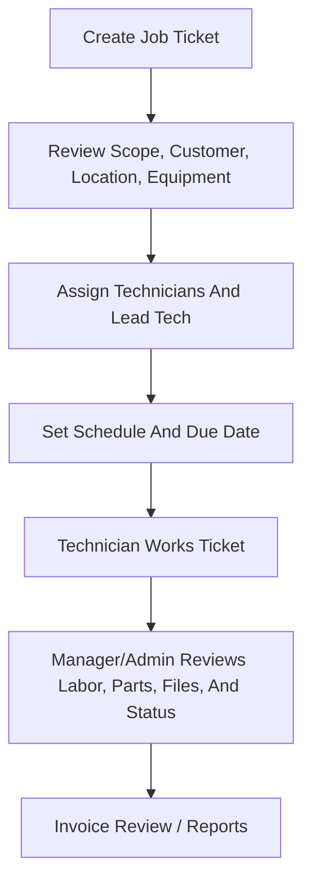
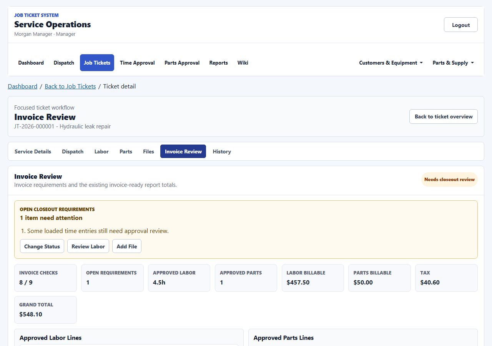
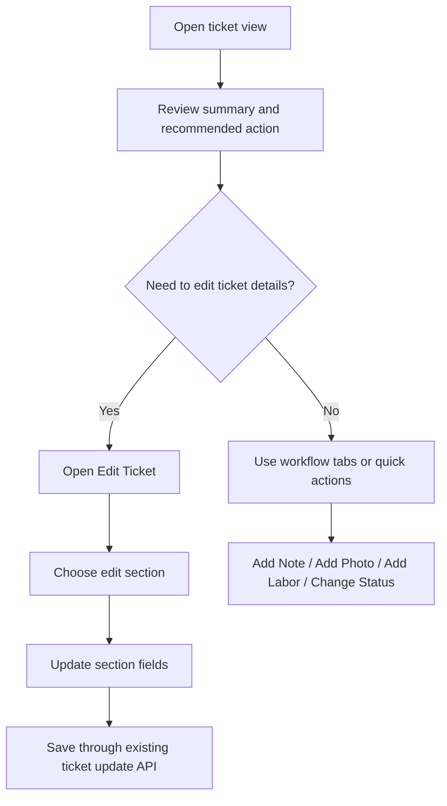
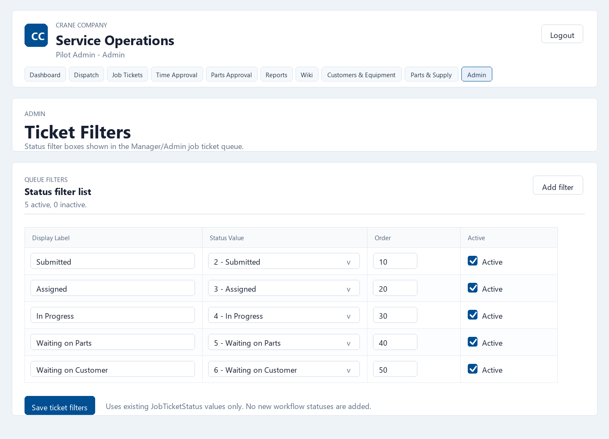

# Job Ticket System Wiki

## Purpose
This wiki explains how the Job Ticket System is used by Employees, Managers, and Admins. It is written for client handoff and operations training, not for software development.

The system is centered on field-service job tickets:
- create and manage service tickets;
- assign employees to work;
- let technicians clock in, record work, request parts, and upload photos/files;
- let Managers/Admins review work, time, parts, reports, users, and supporting master data;
- preserve role boundaries so each user sees the tools appropriate to their job.

Screenshots in this wiki are captured from the demo/pilot environment. They are intended to show screen layout and workflow behavior, not production customer data.

## Client Quick Start

For a first client walkthrough, use this order:

1. Start with [Roles And Access](#roles-and-access) so users understand what each account type can do.
2. Confirm [Company Configuration](#company-configuration) before showing branded UI or report output.
3. Review [Sign-In And Session Behavior](#sign-in-and-session-behavior).
4. Walk technicians through [Employee Workflow](#employee-workflow).
5. Walk office staff through [Manager/Admin Workspace](#manageradmin-workspace).
6. Review [Time Tracking And Approval](#time-tracking-and-approval), [Parts And Part Requests](#parts-and-part-requests), and [Reports](#reports).
7. Review [Production Demo Operations](#production-demo-operations) before a VPS-backed client demo.
8. Finish with [Current Scope Boundaries](#current-scope-boundaries) so the client knows what is intentionally not included.

For live training, use the [Client Training Checklist](#client-training-checklist) near the end of this wiki.

## Screenshot Index

The screenshots below appear again in the workflow sections where they are most relevant:

| Screen | Screenshot |
| --- | --- |
| Login | [login.png](assets/system-wiki/login.png) |
| Employee assigned jobs concise list | [employee-jobs.png](assets/system-wiki/employee-jobs.png) |
| Employee job detail clock-in-first workflow | [employee-job-detail.png](assets/system-wiki/employee-job-detail.png) |
| Manager/Admin dashboard | [manager-dashboard.png](assets/system-wiki/manager-dashboard.png) |
| Job-ticket queue rich and compact views | [job-ticket-queue.png](assets/system-wiki/job-ticket-queue.png) |
| Job-ticket workspace | [job-ticket-workspace.png](assets/system-wiki/job-ticket-workspace.png) |
| Section-based ticket editor | [ticket-section-editor.png](assets/system-wiki/ticket-section-editor.png) |
| Quick note workflow | [ticket-quick-note.png](assets/system-wiki/ticket-quick-note.png) |
| Status review workflow | [ticket-status-review.png](assets/system-wiki/ticket-status-review.png) |
| Labor workflow | [ticket-labor-workflow.png](assets/system-wiki/ticket-labor-workflow.png) |
| Parts add/request workflow | [ticket-parts-workflow.png](assets/system-wiki/ticket-parts-workflow.png) |
| Invoice review workflow | [ticket-invoice-review.png](assets/system-wiki/ticket-invoice-review.png) |
| Mobile ticket workspace | [ticket-workspace-mobile.png](assets/system-wiki/ticket-workspace-mobile.png) |
| Mobile ticket editor | [ticket-edit-mobile.png](assets/system-wiki/ticket-edit-mobile.png) |
| Mobile labor workflow | [ticket-labor-mobile.png](assets/system-wiki/ticket-labor-mobile.png) |
| Mobile parts workflow | [ticket-parts-mobile.png](assets/system-wiki/ticket-parts-mobile.png) |
| Time approval | [time-approval.png](assets/system-wiki/time-approval.png) |
| Parts requests | [part-requests.png](assets/system-wiki/part-requests.png) |
| Master data customers | [master-data-customers.png](assets/system-wiki/master-data-customers.png) |
| Purchasing support | [purchasing.png](assets/system-wiki/purchasing.png) |
| Reports hub | [reports-hub.png](assets/system-wiki/reports-hub.png) |
| Admin users | [admin-users.png](assets/system-wiki/admin-users.png) |
| Ticket filter configuration | [ticket-status-filters.png](assets/system-wiki/ticket-status-filters.png) |

## Roles And Access

### Employee
Employees use the mobile-focused job workflow.

Employee users can:
- sign in;
- view jobs assigned to them;
- open assigned job details;
- review job readiness information;
- clock in and clock out with GPS;
- add work notes after clocking into the job;
- add or request parts after clocking into the job;
- upload job photos/files after clocking into the job;
- view work entries, parts/request status, and uploaded files for the assigned job.

Employee users cannot:
- view Manager/Admin workspace screens;
- manage users;
- manage master data;
- view part cost, billable price, vendor cost, purchase history, inventory controls, catalog cleanup, or invoice-facing billing controls.

### Manager
Managers use the Manager workspace for operational coordination.

Manager users can:
- view the dashboard;
- create and manage job tickets;
- assign employees;
- review job-ticket details and workflow tabs;
- review and update status/priority;
- review employee time entries;
- approve, reject, or edit-and-approve time entries;
- manage customer, location, equipment, vendor, part category, and part records;
- review part requests;
- use reports;
- use the existing purchasing-support screen.

Manager users cannot:
- access Admin-only user management;
- weaken role boundaries;
- perform hard deletes.

### Admin
Admins have Manager capabilities plus user administration.

Admin users can:
- manage Company Configuration for the crane company's own logo, profile, and colors;
- manage which status filter options appear in the Manager/Admin job-ticket queue;
- create user accounts;
- edit user account information;
- deactivate/archive users;
- reset user passwords;
- filter users by search, role, and active/inactive status;
- access all Manager/Admin operational screens.

## Navigation Overview

### Public And Login
- `/login`: sign-in screen.
- `/health`: public system health endpoint.
- `/api/system/info`: public system information endpoint.

### Employee Routes
- `/jobs`: employee assigned jobs list.
- `/jobs/{jobTicketId}`: employee job detail and field-recording workflow.

### Manager/Admin Routes
- `/manage`: Manager/Admin dashboard.
- `/manage/job-tickets`: job-ticket queue.
- `/manage/job-tickets/new`: create job ticket.
- `/manage/job-tickets/{jobTicketId}`: job-ticket workspace.
- `/manage/customers`: customers.
- `/manage/service-locations`: service locations.
- `/manage/equipment`: equipment.
- `/manage/parts`: parts, vendors, and part categories.
- `/manage/part-requests`: parts request queue.
- `/manage/purchasing`: purchasing support.
- `/manage/parts-usage-history`: parts usage history visibility.
- `/manage/time-approval`: time approval queue.
- `/manage/parts-approval`: parts approval workflow.
- `/manage/reports`: reports hub.
- `/manage/company-configuration`: Admin-only company profile, logo, and color settings.
- `/manage/ticket-status-filters`: Admin-only ticket status filter configuration.
- `/manage/users`: Admin-only user management.
- `/manage/dispatch`: legacy bookmark route that redirects to `/manage/job-tickets`.

## Production Demo Operations

The current VPS baseline is ready for controlled production demos after validation, health checks, and backup verification pass. This is separate from full client production go-live, which still requires restore-drill evidence, off-host backup storage, alerting, and UAT signoff.

Before a client-facing VPS demo, the operator should confirm:
- frontend and backend validation passed for the deployed commit;
- `GET /health` returns `Healthy` through the public site and the local VPS proxy;
- SQL Server, API, and frontend containers are healthy;
- a fresh backup exists under `/opt/job-ticket-system/backups/<UTC stamp>/`;
- the SQL backup reported `RESTORE VERIFYONLY` as valid;
- uploaded files/photos were archived with the same backup stamp;
- `job-ticket-production-backup.timer` is active on the VPS for recurring backups;
- normal production restarts keep `TestBootstrap` and `PilotDemoSeed` disabled.

The source-controlled backup entrypoint is `scripts/production-backup.sh`. It creates a SQL Server backup, verifies it, archives uploaded files/photos, and applies retention cleanup. The current Ubuntu VPS runs that script through the `job-ticket-production-backup.timer` systemd timer.

See [Production Demo Readiness - June 22, 2026](/docs/production-demo-readiness-2026-06-22.md) and [Production Readiness Runbook](/docs/production-readiness-runbook.md) for the command-level checklist.

For the Employee clock-in-first and Manager/Admin compact queue update, deploy only after the draft PR is reviewed, validated, and merged to `main`. The VPS checklist in the production runbook includes the required post-merge smoke tests and screenshot refresh targets.

## Sign-In And Session Behavior

1. The user opens the application and signs in with a username and password.
2. After sign-in:
   - Employee users are sent to `/jobs`.
   - Manager and Admin users are sent to `/manage`.
3. Protected routes require an authenticated user with the correct role.
4. Unauthorized users are redirected away from restricted screens.
5. Inactive, archived, or deleted users should not be allowed to continue using protected workflows.

## Employee Workflow

### Assigned Jobs List
The employee job list is a short mobile work list, not a dashboard. Each card gives the technician enough context to choose the right job without scanning extra summary panels.

Employees can review:
- ticket number;
- title;
- priority;
- status;
- scheduled start;
- due date;
- customer and service location;
- equipment being serviced;
- readiness status and the next required update;
- one primary action: **Open / Clock In** when the job is ready, or **Review Job** when setup needs attention.

Fully closed tickets do not appear in the normal employee assigned-job list. This includes Completed, Cancelled, Invoiced, and Reviewed tickets. Those tickets are not deleted; Managers/Admins can still find them in the job-ticket queue, ticket workspace, reports, history, and audit trails.

Readiness helps employees understand whether a job has enough information to start. It may flag:
- inactive field-work status;
- missing scheduled start;
- missing due date;
- missing customer;
- missing service location.

### Opening A Job
When an employee opens a job, the detail screen shows:
- ticket number and title;
- status and priority;
- customer, service location, and equipment labels;
- job description;
- a short "Before You Start" readiness review;
- a plain-language "Next action" card;
- clock-in/clock-out controls.

The "Next action" card is the technician's main guide. Before clock-in, it points the employee to clock in or to finish the already-active ticket. After clock-in, it shows short links for Add Note, Add Part, Upload Photo, and Clock Out so the employee can do one field update at a time.

Before clock-in, the deeper field tools are hidden behind a clear message. After the technician clocks into that exact ticket, the active-job tools appear:
- work note form;
- add/request part form;
- upload photo/file form;
- work entries;
- parts requests and usage;
- uploaded files/photos.

The UI should show names and labels, not customer IDs, service-location IDs, equipment IDs, or GUIDs.

### Job Readiness Review
The job detail page includes a "Before You Start" review.

It checks:
- ticket availability for field work;
- scheduled start;
- due date;
- customer;
- service location;
- crane/equipment being serviced;
- job instructions.

If information is missing, the employee should contact a Manager/Admin before starting or continuing work.

### Clock In
Employees clock in from the job detail screen.

Clock-in records:
- job ticket;
- employee;
- GPS latitude;
- GPS longitude;
- GPS accuracy;
- device metadata;
- optional clock note.

If GPS is unavailable or the request fails, the screen shows an error.

### Clock Out
Employees clock out from the same job detail screen.

Clock-out requires:
- an open time entry for the same job;
- a work summary;
- GPS information.

Clock-out records:
- clock-out GPS latitude;
- clock-out GPS longitude;
- GPS accuracy;
- work summary;
- optional note.

### Field Recording Guard
Employees must be clocked into the selected job before adding field records.

The guard applies to:
- work notes;
- ticket parts;
- part requests;
- photo/file uploads.

If an employee is clocked into another job, they must open that active ticket or clock out before recording work on a different ticket.

The Employee screen hides the field-recording forms until the technician is clocked into that exact ticket. This keeps mobile scrolling short and prevents work notes, parts, or photos from being added to the wrong time entry.

Manager/Admin back-office actions are not gated by an employee clock-in.

### Add Work Note
Employees can add work notes only after clocking into the job.

Work notes are for:
- progress updates;
- site conditions;
- performed work details;
- information the office needs to review.

### Add Or Request Part
Employees can add or request a part only after clocking into the job.

Employees can:
- search existing safe part records by part number, name, or description;
- select an existing part;
- type a new/unlisted part;
- enter quantity;
- enter notes;
- mark whether the part needs to be ordered;
- choose urgency when ordering is needed;
- enter needed-by date when ordering is needed.

If `Needs ordered` is selected:
- the item appears in the Manager/Admin parts request queue.

If `Needs ordered` is not selected:
- the item is recorded on the ticket without creating a back-office order queue item.

Technicians do not see or enter:
- unit cost;
- billable price;
- vendor cost;
- purchase history;
- catalog administration;
- inventory controls;
- invoice-facing billing fields.

### Upload Photo Or File
Employees can upload files only after clocking into the job.

Allowed file types:
- JPG;
- JPEG;
- PNG;
- WebP;
- PDF.

Employees can add an optional caption.

Unsupported file types are rejected.

Files must be 50 MB or smaller.

## Manager/Admin Workspace

### Dashboard
The dashboard is a quiet summary screen. It shows the current shape of the work without trying to replace the job-ticket queue.

Typical dashboard actions include:
- review active job tickets;
- open filtered job queues;
- check assignment and schedule attention areas;
- move into time approval, parts requests, reports, or master-data workflows.

Dashboard links use the same Manager/Admin role boundary as the rest of the workspace. Primary and secondary dashboard actions use the shared Manager/Admin button styling so shortcuts look consistent with the job-ticket queue and wiki links.

### Job Ticket Queue
The job-ticket queue is the main Manager/Admin work list.

Managers/Admins can filter by:
- status;
- priority;
- customer;
- work readiness;
- attention condition;
- search text.

The status choices in the queue come from Admin configuration. Admins choose the display label, existing ticket status value, display order, and active/inactive flag. If no custom configuration exists, the queue uses the default active field-work filters: Submitted, Assigned, In Progress, Waiting on Parts, and Waiting on Customer.

Changing these options does not create a new workflow. It only changes how the Status filter is labeled and ordered in the Manager/Admin queue. Existing ticket status names, numeric values, status-change rules, and reports stay the same.

Managers/Admins can export the currently visible queue rows to CSV. The export reflects the loaded filtered view and includes readable labels for customer, service location, assigned employees, lead employees, and work readiness. It does not create a server-side export job.

Queue URLs are shareable. If a Manager/Admin opens a ticket from a filtered queue, the ticket detail can preserve a safe return link back to that queue.

The queue has two view modes:
- **Rich cards**: the full review card view with readiness detail, assignment context, and timing fields.
- **Compact list**: a denser operating list that prioritizes ticket number, title, customer/location, assigned tech, status, priority, scheduled date, due date, and the Open action.

The selected view is remembered in the browser for that Manager/Admin user session. It does not change the ticket data, filters, CSV export, routes, or authorization rules.

Important queue concepts:
- active job queue;
- waiting tickets;
- waiting on parts;
- invoice-ready queue;
- needs assignment review;
- ready to work queue;
- unassigned tickets;
- tickets needing a lead;
- unscheduled tickets;
- tickets missing a due date.

### Create Job Ticket
Managers/Admins create tickets from `/manage/job-tickets/new`.

Job-ticket creation uses existing master data where applicable:
- customer;
- service location;
- equipment;
- billing party customer;
- assigned manager;
- status and priority;
- schedule and due date;
- job title/type/description;
- internal notes and customer-facing notes.

Validation prevents invalid or incomplete submissions where the UI has enough information to do so.

### Job Ticket Workspace
The Manager/Admin ticket detail page is organized as a field-service workbench.

It includes:
- ticket overview;
- customer context;
- service location context;
- equipment context;
- assignments;
- service scope and notes;
- status and priority review;
- time/labor visibility;
- parts used or requested;
- files/photos;
- activity;
- invoice-ready summary;
- recommended next action;
- workflow tabs.

Workflow tabs include:
- Service Details;
- Assignment & Schedule;
- Labor;
- Parts;
- Files;
- Invoice Review;
- History.

The workspace keeps related work on one screen instead of forcing Managers/Admins through scattered pages.

### Ticket View Workflow
Managers/Admins open a ticket from the job-ticket queue, dashboard links, reports, or another Manager/Admin workflow. The ticket view preserves safe return context where possible, so a user can go back to the filtered queue they came from.

The ticket view is organized around review first and editing second:
- the top summary shows ticket number, title, status, priority, customer, location, equipment, and due date;
- the recommended next action opens the most relevant workflow screen;
- workflow tabs separate Service Details, Assignment & Schedule, Labor, Parts, Files, Invoice Review, and History;
- the side action rail keeps common Manager/Admin actions visible without taking over the whole screen.

This view is intended to answer "what needs attention?" before asking the user to edit anything.

### Assignment And Schedule Workflow
**Plain-language rule:** there is one work record: the job ticket. The system does not have a separate Dispatch module or a separate dispatcher workflow. Managers/Admins create a job ticket, assign technicians, set schedule and due dates, and review the ticket as work moves forward.

Use each area for one clear purpose:
- use **Job Tickets** to create, find, assign, schedule, and edit work records;
- use the ticket workspace's **Assignment & Schedule** tab for assigned technicians, lead tech, schedule, due date, and assignment warnings;
- use the ticket workspace for scope, labor, parts, files, notes, status changes, and closeout review;
- use **Reports** for billing-ready and invoice review.

People are assigned to a job ticket. The customer's crane or other equipment is what the ticket says the team is servicing. It is not assigned as a company resource. If the work is on a component or part, describe that clearly in **Job / Scope** or **Service Instructions**.

Old bookmarks to `/manage/dispatch` redirect to `/manage/job-tickets` so users land in the current workflow.

#### One Job-Ticket Workflow
The job ticket moves through the existing workflow from request through review. Assignment and schedule details are part of that ticket.

The UI uses the real ticket statuses: Draft, Submitted, Assigned, In Progress, Waiting on Parts, Waiting on Customer, Completed, Cancelled, Invoiced, and Reviewed. It does not invent separate Requested, Scheduled, or Dispatched statuses.

#### Quick Views
The Job Tickets screen has a small set of practical quick views:
- **Active tickets**;
- **Waiting**;
- **Missing due**;
- **Unassigned**;
- **Needs review**;
- **Ready to work**.

These quick views are not a second workflow. They only apply filters to the same job-ticket list. Admin-configured status labels stay in the Status filter so the screen does not become crowded with shortcut boxes.

#### Compact List
The Job Tickets screen has two views:
- **Rich cards** for deeper review;
- **Compact list** for day-to-day scanning.

The compact list keeps each row focused on:
- ticket number and title;
- status and priority badges;
- customer and service location;
- lead tech and assigned team;
- work readiness;
- schedule and due timing;
- one **Open Ticket** action.

Use the compact list when the queue feels busy. It is designed to keep the important operating signals visible without bringing back a separate Dispatch screen.

#### Assignment And Schedule Checks
The system checks for the information Managers/Admins need before field work is clear:
- assigned technician;
- lead tech;
- scheduled start;
- due date;
- customer;
- service location;
- crane/equipment being serviced, when the ticket is for a whole equipment record;
- service scope or notes for component-only work.

Missing items appear as **Needs assignment review** or **Needs attention** depending on the screen. Complete tickets show **Ready to work**.

#### Ticket Review And Finalization
Review completed work in the ticket workspace. Managers/Admins review ticket data, labor, parts, files/photos, closeout readiness, and activity there. Moving Completed work to Reviewed remains a ticket action.

#### Billing Readiness
Use Reports for billing-ready and invoice review. Job Tickets do not generate invoices, collect payments, or create a separate billing queue.

#### Mobile Workflow
On mobile:
- use the Job Tickets queue or dashboard links to find the ticket;
- use the compact ticket list for dense scanning;
- open the ticket workspace for Assignment & Schedule, Labor, Parts, Files, Invoice Review, and History;
- focused workflow panels keep the selected task near the top of the screen.

#### Permissions And Validation Rules
Assignment and schedule work is Manager/Admin-only through the existing `/manage` route boundary.

Validation and warnings preserve existing data integrity:
- missing assignment, lead tech, schedule, or due date are shown as review items;
- existing ticket update and employee-assignment APIs remain the persistence boundary;
- no separate dispatch entity, status enum, database table, or API is introduced;
- no auth weakening, enum renumbering, Dispatch-specific schema migration, automatic scheduling, or purchasing/inventory expansion is introduced.

### Ticket Editing
Managers/Admins edit ticket information through a focused in-page panel. The previous workflow opened one large edit form containing customer, service location, equipment, scope, billing, dates, status, and priority fields at the same time. That worked functionally, but it forced users to scan a long form and created extra mobile scrolling.

The new workflow keeps editing in the ticket workspace but splits the edit panel into sections:
- **Basics**: title, job type, priority, and status;
- **Customer & Service Equipment**: customer, service location, billing party, crane/equipment being serviced, quick-add relationship helpers, and recent equipment service history;
- **Scope & Notes**: description, internal notes, and customer notes;
- **Billing**: purchase order and billing contact fields;
- **Schedule**: requested, scheduled start, and due dates.

The same assignment and schedule readiness review remains visible above the edit sections. Users can move between sections without leaving the editor, then save through the existing ticket update workflow.

Workflow tabs and action buttons now open the selected ticket workflow in a focused view. This means the selected panel appears directly under the workflow heading and tabs instead of requiring mobile users to scroll past the overview rail. The focused view includes a **Back to ticket overview** control, and that control closes any open focused panel before returning to the normal ticket overview.

The ticket overview also includes a workflow-guidance area:
- **Recommended next action** names the next practical step, explains the blocker or reason, shows the target workflow, and opens that workflow directly.
- **Ticket workflow path** shows Assignment & Schedule, Field Work, Parts / Files, and Invoice Review so office users can jump to the right stage without hunting through the page.
- The **Invoice Review** workflow shows open closeout requirements before invoice totals so billing handoff work is visible before users review dollars.

The edit workflow should preserve:
- customer/service-location relationships;
- equipment relationships;
- assigned manager context;
- status and priority values;
- notes and schedule fields.

Reason for change:
- reduce long-form scrolling on desktop and mobile;
- make each editing decision easier to understand;
- keep relationship editing separate from notes, billing, and schedule changes;
- preserve the existing backend update behavior while improving the client workflow.

User experience improvements:
- fewer fields compete for attention at one time;
- section buttons make the edit model predictable;
- mobile users can edit one section at a time instead of working through a long stacked form;
- assignment and schedule readiness feedback remains visible while editing;
- quick actions let users add notes, upload photos/files, review labor, or change status without opening the full editor.
- mobile ticket shortcuts keep Add Note, Add Photo, Labor, and Status close to the top of the ticket overview.

Technical implementation details:
- `JobTicketEditorForm` owns the section state and still emits the same ticket update payload.
- The Manager/Admin ticket detail page opens the section editor through the existing `Edit Ticket` action.
- No new route, backend service, database table, enum, migration, or authorization policy was introduced.
- Existing APIs remain in use: ticket update, work-entry add, file upload, status change, archive, assignment, part request, time-entry list, and report summary.

Component changes:
- `frontend/src/pages/manager/JobTicketEditorForm.tsx` now renders section navigation and section panels.
- `frontend/src/pages/manager/JobTicketDetailPage.tsx` exposes quick-action panels for Add Note and Add Photo/File and routes Add Labor to the Labor workflow tab.
- `frontend/src/pages/manager/JobTicketEditorForm.test.tsx` and `frontend/src/pages/manager/JobTicketDetailPage.test.tsx` cover the section navigation and quick-action behavior.

Database impacts: none.

API impacts: none. The enhancement reuses existing endpoints and DTOs.

### Mobile User Experience
On smaller screens, the section-based editor reduces the amount of visible form content. Users choose the section they need, make the change, and save. This avoids the older long-form edit mode where relationship, billing, notes, and schedule controls all appeared in one continuous vertical form.

Mobile users should prefer:
- quick actions for simple notes and photos/files;
- the Labor tab for reviewing labor/time entries;
- the Status Review panel for status changes;
- section editing only when ticket details need to change.

On the mobile ticket overview, the compact quick-action row gives direct access to Add Note, Add Photo, Labor, and Status without waiting for users to scroll into the side rail.

### Section-Based Editing Architecture
Section-based editing is a frontend presentation architecture. It does not split the backend ticket update command. The frontend keeps one edit draft and one save action so existing validation, API contracts, and persistence behavior remain stable.

Section responsibilities:
- Basics handles identity/status fields.
- Customer & Equipment handles relationship fields and quick-add relationship helpers.
- Scope & Notes handles narrative fields.
- Billing handles closeout billing metadata.
- Schedule handles date/time planning fields.

### User Permissions And Edit Controls
Manager/Admin users can access the ticket workbench and ticket edit controls. Employee users remain in the mobile employee workflow and do not receive Manager/Admin ticket-edit controls.

Protected controls:
- Edit Ticket;
- Add Note;
- Add Photo;
- Add Labor;
- Change Status;
- Archive Review;
- Add / Request Part;
- assignment controls.

The enhancement does not weaken authorization. It only changes the Manager/Admin frontend layout and quick-action access points.

### Quick Actions
Quick actions are short paths for common ticket updates:
- **Add Note** opens the focused History workflow with a note panel and saves a Manager/Admin work entry to ticket history.
- **Add Photo** opens the focused Files workflow with an upload panel for JPG, PNG, WebP, or PDF files and can mark the file for invoice review.
- **Add Labor** opens the focused Labor workflow tab for time/labor review and follow-up.
- **Change Status** opens a focused Status Review panel with warnings and status selection.
- **Open Add / Request Part Panel** opens the focused Parts workflow with the existing in-ticket add/request form.

Quick actions are intended for small updates. Use the section editor when relationship, billing, schedule, or detailed ticket fields need to change.

Mobile focused workflows keep the selected panel directly under the workflow tabs so users do not need to hunt below the ticket overview rail.

### Ticket Workflow Audit And Repairs
The Service Ticket workflow audit completed on June 18, 2026 verified the existing business workflow without redesigning it. The audit covered workflow tabs, ticket actions, workflow cards, mobile visibility, and accessibility cues.

Findings and repairs:
- workflow tabs already changed active content, but action shortcuts could leave the target panel below the normal overview rail on mobile;
- quick-action drawers did not have a reliable focus target, which made the opened panel less obvious for keyboard and assistive-technology users;
- the focused workflow panel could take focus back from an opened drawer;
- **Back to ticket overview** returned from focused mode but did not close an open focused drawer;
- active tab and drawer focus contrast needed stronger shared styling.

Implemented repairs:
- direct workflow tab and action-rail navigation now sets the URL-backed `view=workflow` state;
- Add Note, Add Photo, Add Labor, Add / Request Part, Edit Ticket, Change Status, and Archive Review open focused panels where appropriate;
- drawer panels receive programmatic focus when opened;
- workflow panel focus waits when a drawer is active;
- **Back to ticket overview** clears open focused drawers;
- global error messages announce as alerts;
- active workflow tabs and focused drawers use stronger shared contrast/focus styling.

See [Service Ticket Workflow Audit - June 18, 2026](/docs/service-ticket-workflow-audit-2026-06-18.md) for the detailed audit report, root cause notes, regression results, and remaining recommendations.

### Assignment Management
Managers/Admins can assign active, non-archived Employee users to tickets.

Assignments may include lead assignment behavior where supported by the UI.

The employee assignment dropdown uses a Manager/Admin-safe employee lookup and does not expose full Admin-only user-management data.

### Status Review
Managers/Admins can review and update ticket status.

Status changes should remain intentional because they affect queue placement, readiness, reporting, and closeout behavior.

### Archive Review
Archiving is soft-delete behavior. Records are preserved but removed from ordinary active workflows.

Managers/Admins use archive review controls rather than hard deletion.

## Time Tracking And Approval

### Employee Time Capture
Employees create time entries by clocking in and clocking out of assigned jobs.

Time entries connect field activity to:
- employee;
- job ticket;
- GPS points;
- work summary;
- labor review.

### Manager/Admin Time Approval Queue
The Time Approval screen is queue-first.

It loads pending entries by default.

Managers/Admins can filter by:
- date range;
- employee name;
- approval status;
- broad job/customer/site/location search.

Managers/Admins can:
- review entry context;
- approve eligible completed pending entries;
- reject entries with a reason;
- edit and approve with an audit reason;
- bulk approve eligible completed pending entries.

Manager edits reuse audit-safe adjustment behavior.

The system does not add unsupported payroll, break-duration, or labor-type schema concepts in this workflow.

## Parts And Part Requests

### Technician Part Capture
From an assigned job, technicians can:
- choose an existing safe part lookup result;
- type an unlisted part;
- record quantity and notes;
- mark whether the part needs ordered.

This keeps the technician workflow simple and field-focused.

### Manager/Admin Parts Request Queue
Needs ordered items appear in the Manager/Admin parts request queue.

Managers/Admins can:
- filter and search requests;
- open request details;
- update request status;
- add internal notes;
- match the request to an existing catalog part;
- record part cost snapshot;
- record billable price snapshot;
- mark billable state.

This is a ticket-support workflow. It is not automatic purchasing, automatic approval, or automatic compatibility.

### Parts Usage History
Parts usage history gives Managers/Admins visibility into historical usage.

The wording is intentionally cautious. It should not be treated as:
- recommendations;
- scoring;
- compatibility automation;
- AI guidance.

## Master Data

Master data supports job-ticket operations. It should be kept clean because tickets, reports, and field workflows rely on these records.

### Customers
Customer records represent the customer or account tied to work.

Managers/Admins can:
- create customers;
- edit customer information;
- archive/unarchive customers;
- filter and review customer records.

Customer data can include:
- name;
- account/contact details;
- billing-related contact fields where supported.

### Service Locations
Service locations represent where work is performed.

Managers/Admins can:
- create service locations;
- associate locations with customers;
- edit address/location details;
- archive/unarchive locations;
- filter and review locations.

Service locations should remain aligned to the correct customer.

### Equipment
Equipment records represent assets serviced by the company.

Managers/Admins can:
- create equipment;
- associate equipment with a customer and service location;
- edit model/serial/type/ownership details where supported;
- archive/unarchive equipment;
- filter and review equipment.

Equipment create/edit workflows guard against mismatched customer and service-location relationships where the UI has enough data to validate.

### Vendors
Vendor records support existing purchasing and part workflows.

Managers/Admins can:
- create vendors;
- edit vendor contact/account details;
- archive/unarchive vendors;
- filter and review vendors.

### Part Categories
Part categories organize catalog parts.

Managers/Admins can:
- create categories;
- edit descriptions;
- archive/unarchive categories;
- filter and review categories.

### Parts
Part records represent catalog parts used in job tickets, part requests, reports, and purchasing support.

Managers/Admins can:
- create parts;
- edit part number, name, description, category, vendor, cost, billable price, quantity-on-hand, and reorder threshold where supported;
- archive/unarchive parts;
- filter by category/vendor;
- review parts.

Negative numeric values are blocked in the UI for part cost, billable price, quantity on hand, and reorder threshold.

Archived relationship records are kept out of blank create-form selectors where appropriate, while existing archived relationships can still be preserved during edit mode.

## Purchasing Support

The purchasing screen documents and supports the purchasing baseline already present in the system.

Managers/Admins can work with:
- purchase orders;
- vendors;
- expected dates;
- purchase-order lines;
- submitted, received, canceled, closed, archived, and unarchived states;
- vendor invoice metadata where already supported;
- landed-cost fields where already supported;
- receipt recording for purchase-order quantities.

This is existing purchasing support. It is not approval to expand into a larger purchasing, accounting, receiving, or vendor-invoice product without a separate approved scope.

The purchasing screen shows success and error feedback for create, submit, receiving, close, archive, and vendor-invoice save actions. Inventory remains hidden until that workflow is completed, so users should treat purchasing as purchase-order coordination rather than a complete warehouse workflow.

## Reports

Reports are Manager/Admin-only.

The reports hub is organized into:
- invoice/closeout reports;
- labor/parts reports;
- service-history reports.

Implemented report types include:
- invoice-ready summary for a selected job ticket;
- job cost summary for a selected job ticket;
- jobs ready to invoice;
- labor by job;
- labor by employee;
- parts by job;
- customer service history;
- equipment service history.

Reports support shared filters where applicable:
- from date;
- to date;
- customer;
- billing party customer;
- service location;
- employee;
- job status;
- invoice status;
- offset;
- limit.

The frontend validates required source selections, date ranges, and paging values before calling report APIs.

Report inputs are saved per report on the user's browser. For example, changing the selected job ticket on Invoice-ready Summary does not change the selected job ticket on Job Cost Summary. Use **Reset report inputs** to clear saved report defaults and return filters to their standard values.

### Report Output
Generated reports continue to open in a separate results screen within the reports workflow. Report groups use unframed sections with repeated report cards, while generated output uses a single bordered preview surface.

From generated report results, users can:
- review report metadata, including visible row count, visible column count, generated time, and applied scope;
- review rows in an export-friendly table;
- run the same report again with the current source and filters;
- export currently loaded rows to a date-stamped CSV file;
- use browser print/save-PDF output where rows are available.

Important reporting boundaries:
- PDF output uses the browser print dialog.
- CSV export is generated in the browser from currently loaded rows and includes report metadata at the top of the file.
- Company Configuration details appear in report print/save-PDF headers and CSV metadata when saved.
- Empty reports do not expose CSV or print/save-PDF actions.
- The system does not generate invoices.
- The system does not collect payments.
- The system does not provide a customer portal.
- The system does not run server-side reporting jobs.

### Future Service Estimate / Quote Export Direction

Real crane-company service estimates read as formal customer-facing work-order quote packets rather than generic reports. When this becomes approved scope, the export should use Company Configuration for the crane company's own identity and continue using customer, work site, contact, and equipment data from job-ticket/customer records.

A future service estimate or quote export should support:
- branded header with company logo, company address/contact details, and optional compliance or association marks;
- document stripe with document type, quote/work-order number, page count, and date;
- customer block separate from work-site block;
- customer contact, phone, email, and salesperson/service representative details;
- equipment block with serial number, unit make, unit description, and unit model;
- description-of-work section;
- parts, mileage, labor, and miscellaneous line items with part number, description, quantity, unit measure, unit cost, and total cost;
- estimate total separated clearly from line-item details;
- terms, finance-charge language, or other legal footer text managed as future company/export configuration.

This is future export guidance only. It does not change the current customer-selection workflow, does not create quotes, and does not replace the existing browser print/save-PDF report output.

## Company Configuration

Company Configuration is Admin-only and represents the crane company's own identity. It is not the customer/account record used when choosing who work is for on a job ticket.

Admin-only access:
- `/manage/company-configuration`

Admins can manage:
- company name and legal name;
- primary contact;
- phone, email, and website;
- address;
- company logo;
- primary, secondary, and accent colors.

Company Configuration is used by:
- the login screen brand area;
- the Manager/Admin shell header;
- generated report print/save-PDF headers;
- generated report CSV metadata;
- shared UI brand color variables.

Logo upload accepts JPG/JPEG, PNG, and WebP images up to 2 MB. The upload path validates file extension, content type, size, and image signature before storing the file.

Customer records remain separate. The Customers screen and job-ticket customer, billing-party customer, service-location, and equipment selections continue to represent the customer or account receiving the work.

API summary:
- `GET /api/company-configuration`: public branding/profile read for the UI.
- `PUT /api/company-configuration`: Admin-only profile and color update.
- `POST /api/company-configuration/logo`: Admin-only logo upload.
- `GET /api/company-configuration/logo`: public logo stream when a logo exists.

## Ticket Filter Configuration

Ticket Filter Configuration is Admin-only and controls the status shortcut boxes shown in the Manager/Admin job-ticket queue.

Admin-only access:
- `/manage/ticket-status-filters`

Admins can:
- view the current status filter list;
- add a filter that maps to an existing ticket status;
- rename the label shown on a filter box;
- change display order;
- mark a filter active or inactive;
- save the global filter list.

Managers can use the resulting filters in the job-ticket queue, but Managers cannot edit the configuration. Employees cannot access this configuration.

Important boundaries:
- this is not a custom workflow engine;
- it does not add new ticket statuses;
- it does not change ticket status numeric values;
- it does not change status transition rules;
- inactive filters do not appear in the normal queue shortcut row;
- closed tickets remain available to Manager/Admin users through queue filters, ticket workspace, reports, and history.

API summary:
- `GET /api/ticket-status-filters`: Manager/Admin-readable filter list.
- `PUT /api/ticket-status-filters`: Admin-only save for labels, mapped existing status values, display order, and active/inactive flags.

## Admin User Management

Admin-only user management is available at `/manage/users`.

Admins can:
- search accounts;
- filter by role;
- filter by active/inactive status;
- create users;
- edit users;
- deactivate/archive users;
- reset passwords.

Managers cannot access this screen.

User-management workflows should preserve:
- role boundaries;
- active/inactive state handling;
- no hard deletes;
- no auth weakening.

## Data Display Rules

The UI should display business labels instead of internal IDs.

Examples:
- customer name instead of customer ID;
- service location name instead of service-location ID;
- equipment name/number instead of equipment ID;
- employee name instead of employee ID where the screen supports it.

IDs remain important for API operations, but the client-facing UI should avoid exposing GUID-like values when human-readable data is available.

## Archive And Unarchive Behavior

Archive means the record is removed from normal active workflows but retained for history.

Archive/unarchive applies to many operational records, including:
- customers;
- service locations;
- equipment;
- parts;
- vendors;
- part categories;
- stock locations;
- purchase orders where supported;
- users through Admin management.

The project uses soft-delete/archive behavior rather than hard deletion.

## Validation And Error Behavior

The UI should guide users before bad data is submitted.

Common validation examples:
- required names cannot be blank or whitespace-only;
- part numeric values cannot be negative;
- equipment year must be a whole year between 1900 and 2100 where the field is used;
- equipment customer and service location must align;
- required report source IDs must be selected before generating source-specific reports;
- invalid report date ranges and paging values are blocked;
- employees must be clocked into the selected job before recording field work.

When a request fails, the screen should show a useful error message and keep the user in the workflow.
Manager/Admin ticket workspace refreshes, Employee mobile post-action refreshes, and Parts Request Queue filter reloads should also clear loading states after failures, so users are not left waiting without feedback or told that a saved action failed.

## Recommended Operating Process

### Daily Manager/Admin Flow
1. Open the dashboard.
2. Review the quiet operations summary.
3. Open Job Tickets and choose **Compact list** for fast scanning or **Rich cards** for deeper readiness review.
4. Use Quick Views for Active tickets, Waiting, Missing due, Unassigned, Needs review, and Ready to work.
5. Open the ticket workspace and use **Assignment & Schedule** to assign technicians, mark the lead tech, and set schedule and due dates.
6. Confirm the crane/equipment being serviced or describe component-only work in the ticket scope.
7. Review completed work in the ticket workspace.
8. Review tickets waiting on parts.
9. Review pending time entries.
10. Review reports for closeout and invoice-ready work.

### Technician Field Flow
1. Sign in.
2. Open assigned jobs.
3. Pick the correct job from the concise card list.
4. Open the job and review the "Before You Start" readiness summary.
5. Clock in with GPS.
6. Use the active-job tools that appear after clock-in.
7. Record work notes as work is performed.
8. Add/request parts as needed.
9. Upload photos or PDFs as supporting evidence.
10. Clock out with a required work summary.

### Back-Office Parts Flow
1. Open the parts request queue.
2. Filter/search requests.
3. Review the ticket and technician notes.
4. Match to a catalog part if appropriate.
5. Update request status.
6. Add internal status notes.
7. Record cost/billable snapshot if needed.
8. Coordinate any purchasing support manually through the existing purchasing workflow if applicable.

### Closeout Flow
1. Open job tickets that are completed or ready for closeout.
2. Review time entries and approval state.
3. Review parts and part approval state.
4. Review files/photos and work activity.
5. Use invoice-ready and cost-summary reporting.
6. Export or print/save-PDF report results where needed.

## Current Scope Boundaries

The system currently does not include:
- external customer portal;
- client hub workflow;
- online payments;
- payment collection;
- formal service estimate/quote generation;
- quote approval automation;
- customer notification automation;
- new purchasing expansion beyond the existing baseline;
- receiving expansion beyond the existing baseline;
- vendor invoice tracking expansion;
- landed-cost expansion beyond existing supported fields;
- inventory workflow;
- warehouse inventory expansion;
- truck inventory expansion;
- low-stock alerts;
- replenishment automation;
- parts recommendations;
- AI/scoring;
- automatic compatibility decisions;
- automatic approval;
- hard deletes;
- backend enum renumbering.

Any of those areas should be treated as future scope requiring a separate approval and implementation plan.

## Client Training Checklist

Use this checklist when introducing the system to a client team.

### Employee Training
- Sign in and reach assigned jobs.
- Understand job readiness warnings.
- Open a job.
- Clock in with GPS.
- Add a work note.
- Add an existing part.
- Type an unlisted part.
- Mark a part as Needs ordered.
- Upload a photo/file.
- Clock out with a work summary.
- Understand why fields are disabled before clock-in.

### Manager Training
- Use the dashboard.
- Use Job Tickets as the main operating screen.
- Use quick views without letting the page become a wall of shortcuts.
- Confirm the service equipment, then assign technicians and the lead tech in the ticket workspace.
- Set scheduled start and due dates on the ticket.
- Review completed tickets in the ticket workspace and billing-ready work in Reports.
- Filter job-ticket queues.
- Create a job ticket.
- Open the ticket workspace.
- Assign employees.
- Update ticket status/priority.
- Review assignment and schedule readiness.
- Review time entries.
- Approve/reject/edit-and-approve time.
- Review part requests.
- Use reports and exports.
- Manage master data.

### Admin Training
- Create users.
- Edit users.
- Deactivate users.
- Reset passwords.
- Filter accounts.
- Explain Manager vs Admin access.

### Back-Office Training
- Maintain clean customer/location/equipment data.
- Maintain part, vendor, and category data.
- Review Needs ordered part requests.
- Use purchasing support carefully within current scope.
- Produce closeout reports.

## Demo Access

Demo, pilot, and training accounts are environment-specific. For customer sessions, provide usernames and temporary passwords through the agreed handoff channel instead of publishing credentials in the wiki.

Demo users are for controlled demo or pilot environments only and should not be treated as production credentials.

## Support Notes

When reporting an issue, include:
- user role;
- route/screen;
- job ticket number if applicable;
- customer/location/equipment involved;
- exact action attempted;
- visible error message;
- whether the user was clocked into the job;
- browser and device type;
- screenshot if available.

For operational questions, start with:
- Is the user in the correct role?
- Is the ticket assigned to the employee?
- Is the employee clocked into the selected job?
- Is the record archived?
- Is the required master data missing?
- Is the report missing a required source filter?
- Is the workflow trying to use a deferred feature that is intentionally out of scope?
